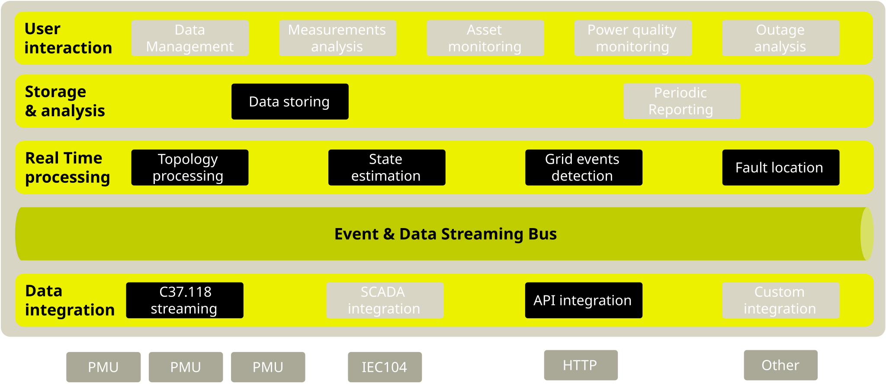

# Real Time API

The Real Time API defines the data format of the data stream, and the protocol to
exchange data between the different components of the system, and with external
systems.

The Real Time API relies on [RabbitMQ] to provide the message brokering system,
and on [Protocol Buffers] to specify the messaging format.

## Messaging Protocol

[RabbitMQ] supports both queue-based and stream-based messaging patterns.
Currently, SynchroGuard relies on both patterns, depending on the use case.

The following streams are currently used in SynchroGuard and available in the
Real Time API:

- `measurement`: the stream of sensor measurements collected from devices in the
  field (such as PMUs, IEDs, etc.), and the [SCADA](../../scada) system.
- `topology`: the stream of topology changes detected by the topology processing
  service.

The following exchanges[^exchange] are currently used in SynchroGuard and can be binded
to customer dedicated queues for the Real Time API:

- `estimated-measurement`: state estimation are published here.
- `event`: power quality, grid load events and faults are pubslished here.

### Messaging Format

The different messages published in the data stream are defined using [Protocol
Buffers], and organized in different packages, depending on the type of data
they represent. The following ones are typically available in the Real Time API:

- [`Data`](../data_format/zaphiro/grid/v1/data.proto/) dedicated to measurements related
messages, used in `measurement` and `estimated-measurement`.
- [`Fault`](../data_format/zaphiro/grid/v1/fault.proto) dedicated to faults related
  messages, used in `event`.
- [`GridEvent`](../data_format/zaphiro/grid/v1/grid_event.proto): events related
    to grid, used in `event`.

Protocol Buffers messages are discussed in the [Data Format](../data_format) section.

#### Metadata

Messages, beside the Protocol Buffers body, include some metadata.
Some of these metadata are specific to the message type, while others are common
to all messages.

##### DataSet

The following headers are available for messages containing a `DataSet` body:

* `id` (string): id of the `DataSet`
* `type` (string): always `DataSet`
* `producerId` (string): the id of the producer (e.g. a PMU) linked to the dataset.
* `timestampId` (int64): related measurement Unix msec timestamp (if any)
* `aligned` (bool, default true): `True` when the `DataSet` is time aligned,
  e.g. data from PMUs.
* `latency` (int64): arrival latency in milliseconds between the measurement timestamp and their injection in the platform.
* `samplingPeriod` (string): optional, used to identify timestamps that match
 `second` or `minute`.
* `sourceType` (SourceType): the Measurement source type.

#### GridEvent

The following headers are available for messages containing a `Event` body:

* `id` (string): id of the `Event`
* `type` (string): always `Event` - used for routing.
* `eventType` (string): the specific type of `GridEvent`, this is required in
  addition to `type` for de-serialization of the messages.
* `producerId` (string): the id of the producer (e.g. a PMU) that generated the event
* `sourceType` (string): the Event source type event.
* `timestampId` (int64): related measurement Unix msec timestamp (if any)

#### Fault

The following headers are available for messages containing a `Fault` body:

* `id` (string): id of the `Fault`
* `type` (string): `Fault`, `LineFault` or `EquipmentFault` depending on the
  type of fault.
* `producerId` (string): the id of the producer (e.g. a PMU) linked to the notification.
* `sourceType` (string): the Fault source type.

## How to use the Real Time API

To use the Real Time API, you need the credentials to access the [RabbitMQ]
instance used by SynchroGuard, and access rights to the relevant streams and
queues. Contact us for a quotation to enable the feature, to get the credentials
and access rights.

You can find example code to connect to the Real Time API and consume data in
the SynchroGuard's [Protocol Buffers](https://github.com/zaphiro-technologies/protobuf?tab=readme-ov-file#examples) GitHub repository.

[RabbitMQ]: https://www.rabbitmq.com/
[Protocol Buffers]: https://developers.google.com/protocol-buffers

[^exchange]: Future versions of SynchroGuard may replace exchanges with streams,
    to provide better support for multiple consumers of the same data, and to
    support reliable data replay.
