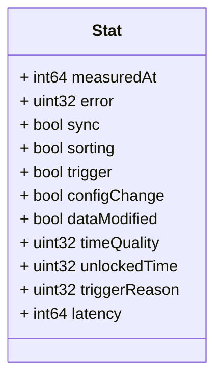

# Package: zaphiro.c37118.v1

Copyright 2024 Zaphiro Technologies Licensed under the Apache License, Version 2.0 (the "License"); you may not use this file except in compliance with the License. You may obtain a copy of the License at http://www.apache.org/licenses/LICENSE-2.0 Unless required by applicable law or agreed to in writing, software distributed under the License is distributed on an "AS IS" BASIS, WITHOUT WARRANTIES OR CONDITIONS OF ANY KIND, either express or implied. See the License for the specific language governing permissions and limitations under the License. <!-- markdownlint-disable -->
Messages to support stat data injection exchange in the platform.

## Imports

| Import | Description |
|--------|-------------|

## Options

| Name       | Value       | Description |
|------------|-------------|-------------|
| go_package | ./c37118/v1 |             |

### Stat Diagram

## Message: Stat

**FQN**: zaphiro.c37118.v1.Stat

A Stat of PMU data, check IEEE C37.118 standard for more details.
Headers used in rabbitMQ:
* `id` (string): id of the `Stat` message.
* `producerId` (string): the id of the producer (e.g. a PMU) linked to the dataset.
* `timestampId` (int64): related measurement Unix msec timestamp (if any)

| Field           | Ordinal | Type     | Label | Description                                                   |
|-----------------|---------|----------|-------|---------------------------------------------------------------|
| `measuredAt`    | 1       | `int64`  |       | The time of creation of the stat data (Unix msec timestamp).  |
| `error`         | 2       | `uint32` |       | Error code uint8                                              |
| `sync`          | 3       | `bool`   |       | Synchronization status                                        |
| `sorting`       | 4       | `bool`   |       | Sorting status                                                |
| `trigger`       | 5       | `bool`   |       | Trigger status                                                |
| `configChange`  | 6       | `bool`   |       | Configuration change status                                   |
| `dataModified`  | 7       | `bool`   |       | Data modification status                                      |
| `timeQuality`   | 8       | `uint32` |       | Time quality uint8                                            |
| `unlockedTime`  | 9       | `uint32` |       | Unlocked time uint8                                           |
| `triggerReason` | 10      | `uint32` |       | Trigger reason uint8                                          |
| `latency`       | 11      | `int64`  |       | Latency in msec                                               |

<!-- Created by: Proto Diagram Tool -->
<!-- https://github.com/GoogleCloudPlatform/proto-gen-md-diagrams -->
