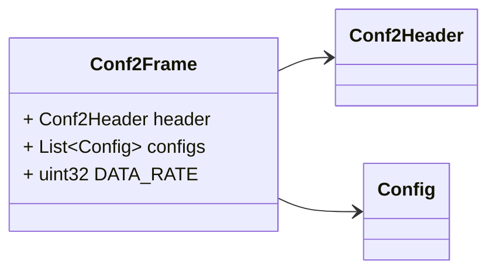
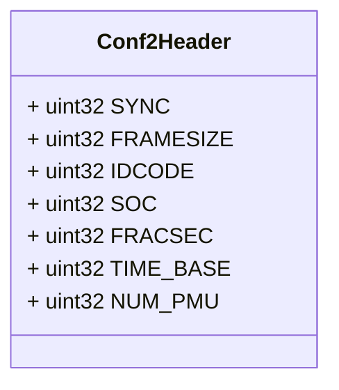
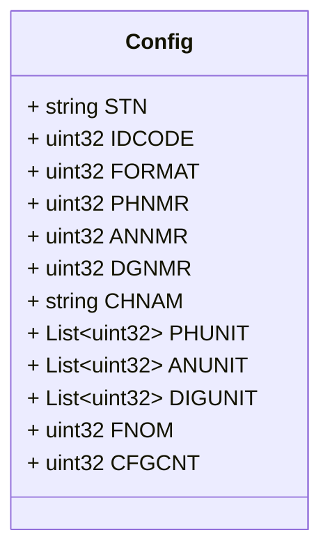

# Package: zaphiro.c37118.v1

 <!-- markdownlint-disable -->
Messages describing PMU C37.118 Configurations. 
See [C37.118](https://www.typhoon-hil.com/documentation/typhoon-hil-software-manual/References/c37_118_protocol.html)
protocol.

## Imports

| Import | Description |
|--------|-------------|

## Options

| Name       | Value       | Description |
|------------|-------------|-------------|
| go_package | ./c37118/v1 |             |

### Conf2Frame Diagram

### Conf2Header Diagram

### Config Diagram

## Message: Conf2Frame

**FQN**: zaphiro.c37118.v1.Conf2Frame

Configuration frame 2 
Headers used in rabbitMQ:
* `id`: id of the `Conf2Frame`
* `type`: always `Conf2Frame`
* `producerId`: the id of the producer (e.g. a PMU) linked to the configuration frame.
* `timestampId`: related measurement timestamp (if any)

| Field       | Ordinal | Type          | Label    | Description                   |
|-------------|---------|---------------|----------|-------------------------------|
| `header`    | 1       | `Conf2Header` |          | Configuration frame 2 header  |
| `configs`   | 2       | `Config`      | Repeated | Set of PMU configurations     |
| `DATA_RATE` | 3       | `uint32`      |          | Rate of data transmission     |

## Message: Conf2Header

**FQN**: zaphiro.c37118.v1.Conf2Header

Configuration frame 2 header

| Field       | Ordinal | Type     | Label | Description                                          |
|-------------|---------|----------|-------|------------------------------------------------------|
| `SYNC`      | 1       | `uint32` |       | Sync byte followed by frame type and version number  |
| `FRAMESIZE` | 2       | `uint32` |       | Number of bytes in the frame                         |
| `IDCODE`    | 3       | `uint32` |       | Stream source ID number                              |
| `SOC`       | 4       | `uint32` |       | SOC time stamp                                       |
| `FRACSEC`   | 5       | `uint32` |       | Fraction of Second and Message Time Quality          |
| `TIME_BASE` | 6       | `uint32` |       | Resolution of FRACSEC time stamp                     |
| `NUM_PMU`   | 7       | `uint32` |       | The number of PMUs included in the data frame        |

## Message: Config

**FQN**: zaphiro.c37118.v1.Config

Single PMU configuration according to Configuration frame 2

| Field     | Ordinal | Type     | Label    | Description                            |
|-----------|---------|----------|----------|----------------------------------------|
| `STN`     | 1       | `string` |          | Station name                           |
| `IDCODE`  | 2       | `uint32` |          | Data source ID number                  |
| `FORMAT`  | 3       | `uint32` |          | Data format within data frame          |
| `PHNMR`   | 4       | `uint32` |          | Number of phasors                      |
| `ANNMR`   | 5       | `uint32` |          | Number of analog values                |
| `DGNMR`   | 6       | `uint32` |          | Number of digital status words         |
| `CHNAM`   | 7       | `string` |          | Phasor and channel names               |
| `PHUNIT`  | 8       | `uint32` | Repeated | Conversion factor for phasor channels  |
| `ANUNIT`  | 9       | `uint32` | Repeated | Conversion factor for analog channels  |
| `DIGUNIT` | 10      | `uint32` | Repeated | Mask words for digital status words    |
| `FNOM`    | 11      | `uint32` |          | Nominal line frequency code and flags  |
| `CFGCNT`  | 12      | `uint32` |          | Configuration change count             |

<!-- Created by: Proto Diagram Tool -->
<!-- https://github.com/GoogleCloudPlatform/proto-gen-md-diagrams -->
