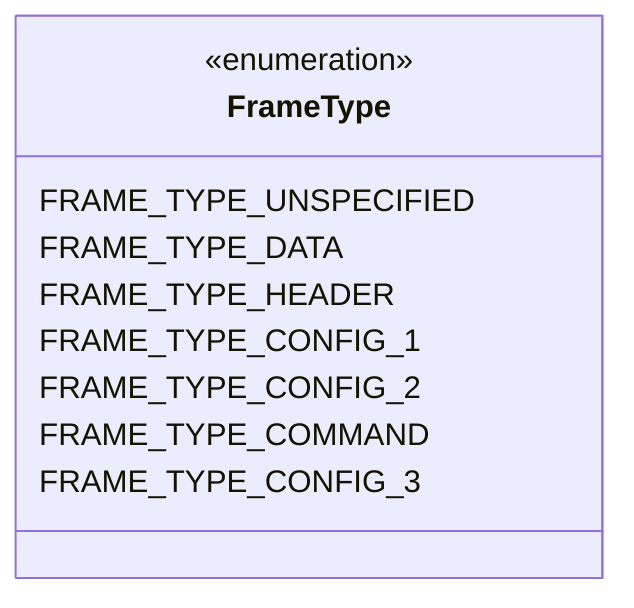
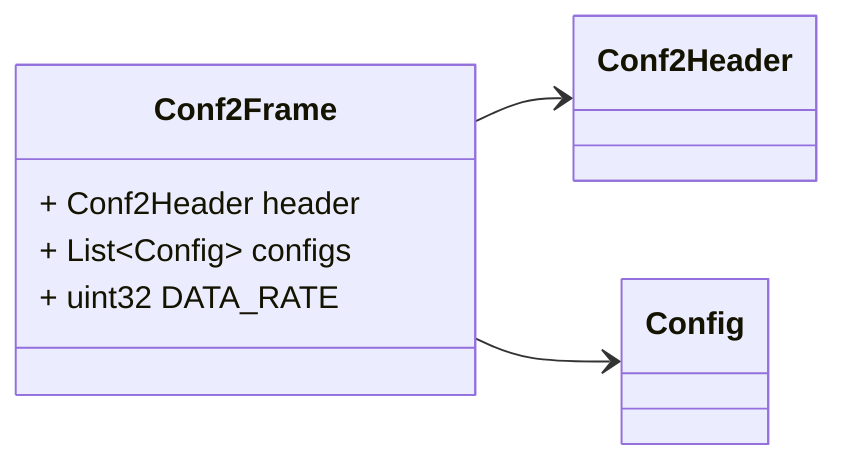
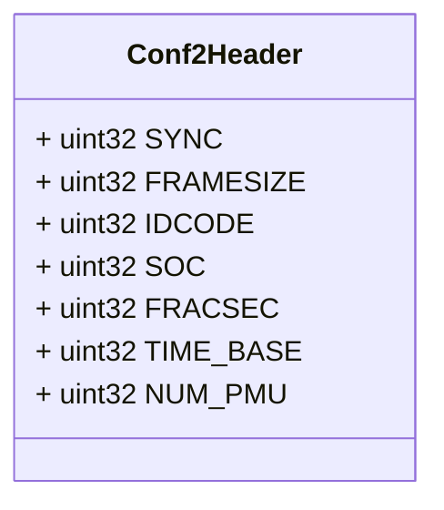
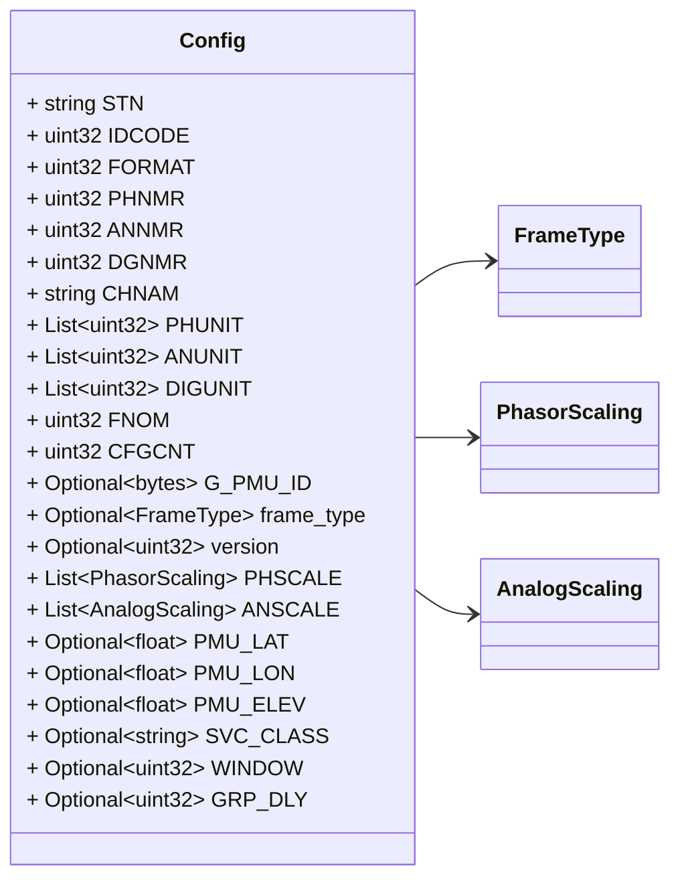
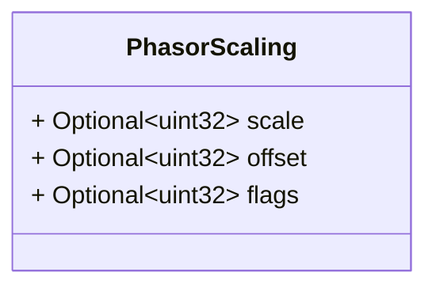
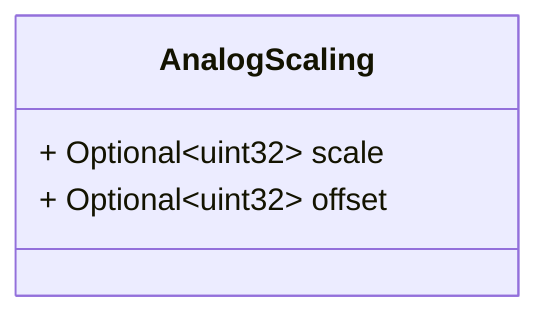

# Package: zaphiro.c37118.v1

Copyright 2024 Zaphiro Technologies Licensed under the Apache License, Version 2.0 (the "License"); you may not use this file except in compliance with the License. You may obtain a copy of the License at http://www.apache.org/licenses/LICENSE-2.0 Unless required by applicable law or agreed to in writing, software distributed under the License is distributed on an "AS IS" BASIS, WITHOUT WARRANTIES OR CONDITIONS OF ANY KIND, either express or implied. See the License for the specific language governing permissions and limitations under the License. <!-- markdownlint-disable -->
Messages describing PMU C37.118 Configurations.
See
[C37.118](https://www.typhoon-hil.com/documentation/typhoon-hil-software-manual/References/c37_118_protocol.html)
protocol.

## Imports

| Import | Description |
|--------|-------------|

## Options

| Name       | Value       | Description |
|------------|-------------|-------------|
| go_package | ./c37118/v1 |             |

## Enum: FrameType

**FQN**: zaphiro.c37118.v1.FrameType

Represents the frame type part of the SYNC word (e.g., 0=Data, 1=Header, 2=CFG1, 3=CFG2, 4=CMD, 5=CFG3) These correspond to the 'X' nibble in the SYNC word 0xAAXY.

| Name                     | Ordinal | Description |
|--------------------------|---------|-------------|
| `FRAME_TYPE_UNSPECIFIED` | 0       |             |
| `FRAME_TYPE_DATA`        | 1       |             |
| `FRAME_TYPE_HEADER`      | 2       |             |
| `FRAME_TYPE_CONFIG_1`    | 3       |             |
| `FRAME_TYPE_CONFIG_2`    | 4       |             |
| `FRAME_TYPE_COMMAND`     | 5       |             |
| `FRAME_TYPE_CONFIG_3`    | 6       |             |

### FrameType Diagram

### Conf2Frame Diagram

### Conf2Header Diagram

### Config Diagram

### PhasorScaling Diagram

### AnalogScaling Diagram

## Message: Conf2Frame

**FQN**: zaphiro.c37118.v1.Conf2Frame

Configuration frame 2
Headers used in rabbitMQ:
* `id`: id of the `Conf2Frame`
* `type`: always `Conf2Frame`
* `producerId`: the id of the producer (e.g. a PMU) linked to the configuration
frame.
* `timestampId`: related measurement timestamp (if any)

| Field       | Ordinal | Type          | Label    | Description                   |
|-------------|---------|---------------|----------|-------------------------------|
| `header`    | 1       | `Conf2Header` |          | Configuration frame 2 header  |
| `configs`   | 2       | `Config`      | Repeated | Set of PMU configurations     |
| `DATA_RATE` | 3       | `uint32`      |          | Rate of data transmission     |

## Message: Conf2Header

**FQN**: zaphiro.c37118.v1.Conf2Header

Configuration frame 2 header

| Field       | Ordinal | Type     | Label | Description                                          |
|-------------|---------|----------|-------|------------------------------------------------------|
| `SYNC`      | 1       | `uint32` |       | Sync byte followed by frame type and version number  |
| `FRAMESIZE` | 2       | `uint32` |       | Number of bytes in the frame                         |
| `IDCODE`    | 3       | `uint32` |       | Stream source ID number                              |
| `SOC`       | 4       | `uint32` |       | SOC time stamp                                       |
| `FRACSEC`   | 5       | `uint32` |       | Fraction of Second and Message Time Quality          |
| `TIME_BASE` | 6       | `uint32` |       | Resolution of FRACSEC time stamp                     |
| `NUM_PMU`   | 7       | `uint32` |       | The number of PMUs included in the data frame        |

## Message: Config

**FQN**: zaphiro.c37118.v1.Config

Single PMU configuration according to Configuration frame 2 and 3

| Field        | Ordinal | Type            | Label    | Description                                                                           |
|--------------|---------|-----------------|----------|---------------------------------------------------------------------------------------|
| `STN`        | 1       | `string`        |          | Station name                                                                          |
| `IDCODE`     | 2       | `uint32`        |          | Data source ID number                                                                 |
| `FORMAT`     | 3       | `uint32`        |          | Data format within data frame                                                         |
| `PHNMR`      | 4       | `uint32`        |          | Number of phasors                                                                     |
| `ANNMR`      | 5       | `uint32`        |          | Number of analog values                                                               |
| `DGNMR`      | 6       | `uint32`        |          | Number of digital status words                                                        |
| `CHNAM`      | 7       | `string`        |          | Phasor and channel names                                                              |
| `PHUNIT`     | 8       | `uint32`        | Repeated | Conversion factor for phasor channels                                                 |
| `ANUNIT`     | 9       | `uint32`        | Repeated | Conversion factor for analog channels                                                 |
| `DIGUNIT`    | 10      | `uint32`        | Repeated | Mask words for digital status words                                                   |
| `FNOM`       | 11      | `uint32`        |          | Nominal line frequency code and flags                                                 |
| `CFGCNT`     | 12      | `uint32`        |          | Configuration change count                                                            |
| `G_PMU_ID`   | 13      | `bytes`         | Optional | --- Config Frame 3 Specific Fields (Optional) --- 16 bytes. Meaning is user-defined.  |
| `frame_type` | 14      | `FrameType`     | Optional | Type of frame derived from SYNC                                                       |
| `version`    | 15      | `uint32`        | Optional | Protocol version derived from SYNC                                                    |
| `PHSCALE`    | 16      | `PhasorScaling` | Repeated | Config-3 phasor scaling                                                               |
| `ANSCALE`    | 17      | `AnalogScaling` | Repeated | Config-3 analog scaling                                                               |
| `PMU_LAT`    | 18      | `float`         | Optional | Latitude                                                                              |
| `PMU_LON`    | 19      | `float`         | Optional | Longitude                                                                             |
| `PMU_ELEV`   | 20      | `float`         | Optional | Elevation                                                                             |
| `SVC_CLASS`  | 21      | `string`        | Optional | Service Class ('M' or 'P')                                                            |
| `WINDOW`     | 22      | `uint32`        | Optional | Phasor Measurement Window Length                                                      |
| `GRP_DLY`    | 23      | `uint32`        | Optional | Group Delay                                                                           |

## Message: PhasorScaling

**FQN**: zaphiro.c37118.v1.PhasorScaling

Scaling information structure used in Config Frame 3 for Phasors.

| Field    | Ordinal | Type     | Label    | Description                                  |
|----------|---------|----------|----------|----------------------------------------------|
| `scale`  | 1       | `uint32` | Optional | Scaling factor                               |
| `offset` | 2       | `uint32` | Optional | Offset factor                                |
| `flags`  | 3       | `uint32` | Optional | Flags associated with phasor scaling/format  |

## Message: AnalogScaling

**FQN**: zaphiro.c37118.v1.AnalogScaling

Scaling information structure used in Config Frame 3 for Analogs.

| Field    | Ordinal | Type     | Label    | Description     |
|----------|---------|----------|----------|-----------------|
| `scale`  | 1       | `uint32` | Optional | Scaling factor  |
| `offset` | 2       | `uint32` | Optional | Offset factor   |

<!-- Created by: Proto Diagram Tool -->
<!-- https://github.com/GoogleCloudPlatform/proto-gen-md-diagrams -->
