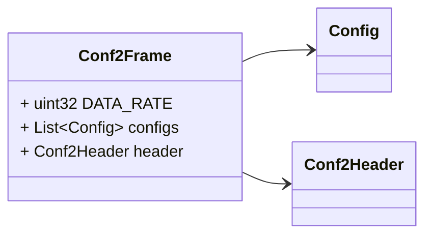
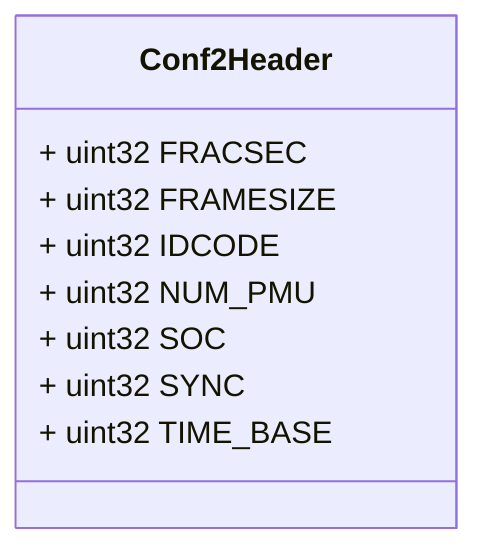
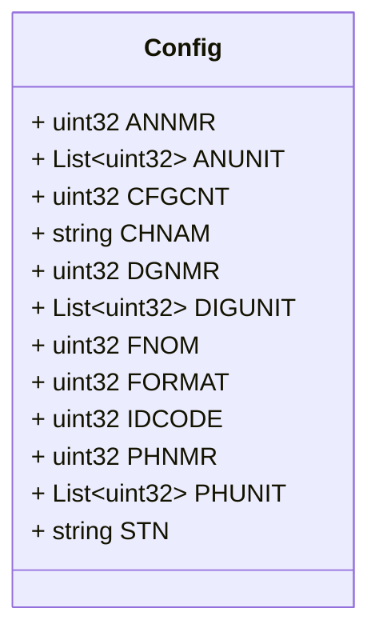

# Package: conf.v1

<!-- markdownlint-disable --> Messages describing PMU C37.118 Configurations.  See [C37.118](https://www.typhoon-hil.com/documentation/typhoon-hil-software-manual/References/c37_118_protocol.html) protocol.  

## Imports

| Import | Description |
|--------|-------------|

## Options

| Name       | Value     | Description |
|------------|-----------|-------------|
| go_package | ./conf/v1 |             |

### Conf2Frame Diagram

### Conf2Header Diagram

### Config Diagram

## Message: Conf2Frame

FQN: conf.v1.Conf2Frame

Configuration frame 2  Headers used in rabbitMQ: * `id`: id of the `Conf2Frame` * `type`: always `Conf2Frame` * `producerId`: the id of the producer (e.g. a PMU) linked to the configuration frame. * `timestampId`: related measurement timestamp (if any)  

| Field     | Ordinal | Type        | Label    | Description                   |
|-----------|---------|-------------|----------|-------------------------------|
| DATA_RATE | 3       | uint32      |          | Rate of data transmission     |
| configs   | 2       | Config      | Repeated | Set of PMU configurations     |
| header    | 1       | Conf2Header |          | Configuration frame 2 header  |

## Message: Conf2Header

FQN: conf.v1.Conf2Header

Configuration frame 2 header 

| Field     | Ordinal | Type   | Label | Description                                          |
|-----------|---------|--------|-------|------------------------------------------------------|
| FRACSEC   | 5       | uint32 |       | Fraction of Second and Message Time Quality          |
| FRAMESIZE | 2       | uint32 |       | Number of bytes in the frame                         |
| IDCODE    | 3       | uint32 |       | Stream source ID number                              |
| NUM_PMU   | 7       | uint32 |       | The number of PMUs included in the data frame        |
| SOC       | 4       | uint32 |       | SOC time stamp                                       |
| SYNC      | 1       | uint32 |       | Sync byte followed by frame type and version number  |
| TIME_BASE | 6       | uint32 |       | Resolution of FRACSEC time stamp                     |

## Message: Config

FQN: conf.v1.Config

Single PMU configuration according to Configuration frame 2 

| Field   | Ordinal | Type   | Label    | Description                            |
|---------|---------|--------|----------|----------------------------------------|
| ANNMR   | 5       | uint32 |          | Number of analog values                |
| ANUNIT  | 9       | uint32 | Repeated | Conversion factor for analog channels  |
| CFGCNT  | 12      | uint32 |          | Configuration change count             |
| CHNAM   | 7       | string |          | Phasor and channel names               |
| DGNMR   | 6       | uint32 |          | Number of digital status words         |
| DIGUNIT | 10      | uint32 | Repeated | Mask words for digital status words    |
| FNOM    | 11      | uint32 |          | Nominal line frequency code and flags  |
| FORMAT  | 3       | uint32 |          | Data format within data frame          |
| IDCODE  | 2       | uint32 |          | Data source ID number                  |
| PHNMR   | 4       | uint32 |          | Number of phasors                      |
| PHUNIT  | 8       | uint32 | Repeated | Conversion factor for phasor channels  |
| STN     | 1       | string |          | Station name                           |

<!-- Created by: Proto Diagram Tool -->
<!-- https://github.com/GoogleCloudPlatform/proto-gen-md-diagrams -->
