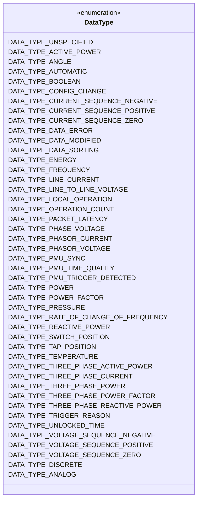
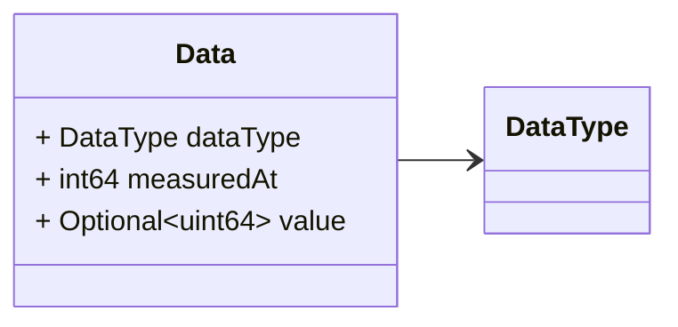
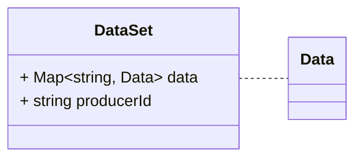

# Package: grid.v1

<!-- markdownlint-disable -->
Messages to support data injection in the platform.
The data injected may be originated from different sources (e.g. a PMU, RTU, an external service).

Data are grouped into sets, where each id identifies a specific measurement. The id does not identify the instance of measurement, but the class of measurement. Measurement ID can be used to retrieve additional medata about the measurement, from example, in the CIM OP profile associated to the monitored grid.

## Imports

| Import | Description |
|--------|-------------|

## Options

| Name       | Value     | Description |
|------------|-----------|-------------|
| go_package | ./grid/v1 |             |

## Enum: DataType

**FQN**: grid.v1.DataType

The collection of Data Types defined so far. They are useful to map
measurements to their rappresentation. Some of the descriptions are taken from [here](https://github.com/3lbits/Grunnprofil/blob/main/DIGIN10/docs/MeasurementType.adoc) This is important since all measurements
are any how cast to UINT64 in the real time platform

| Name                                    | Ordinal | Description                                                              |
|-----------------------------------------|---------|--------------------------------------------------------------------------|
| `DATA_TYPE_UNSPECIFIED`                 | 0       | No type define                                                           |
| `DATA_TYPE_ACTIVE_POWER`                | 1       | Real power in a non-three phase circuit. It maps to an Analog.           |
| `DATA_TYPE_ANGLE`                       | 2       | Angle between voltage and current. It maps to an Analog.                 |
| `DATA_TYPE_AUTOMATIC`                   | 3       | Automatic operation (not manual). It maps to Discrete (True or False).   |
| `DATA_TYPE_BOOLEAN`                     | 4       | Boolean. It maps to Discrete (True or False).                            |
| `DATA_TYPE_CONFIG_CHANGE`               | 5       | Configuration change. It maps to Discrete (True or False).               |
| `DATA_TYPE_CURRENT_SEQUENCE_NEGATIVE`   | 6       | Current sequence negative. It maps to Phasor.                            |
| `DATA_TYPE_CURRENT_SEQUENCE_POSITIVE`   | 7       | Current sequence positive. It maps to Phasor.                            |
| `DATA_TYPE_CURRENT_SEQUENCE_ZERO`       | 8       | Current sequence zero. It maps to Phasor.                                |
| `DATA_TYPE_DATA_ERROR`                  | 9       | Data error. It maps to Discrete (True or False).                         |
| `DATA_TYPE_DATA_MODIFIED`               | 10      | Data modified. It maps to Discrete (True or False).                      |
| `DATA_TYPE_DATA_SORTING`                | 11      | Data sorting. It maps to Discrete.                                       |
| `DATA_TYPE_ENERGY`                      | 12      | Energy. It maps to an Analog.                                            |
| `DATA_TYPE_FREQUENCY`                   | 13      | Frequency. It maps to an Analog.                                         |
| `DATA_TYPE_LINE_CURRENT`                | 14      | Line current. It maps to an Analog.                                      |
| `DATA_TYPE_LINE_TO_LINE_VOLTAGE`        | 15      | Line to line voltage. It maps to an Analog.                              |
| `DATA_TYPE_LOCAL_OPERATION`             | 16      | Local operation (not remote). It maps to Discrete.                       |
| `DATA_TYPE_OPERATION_COUNT`             | 17      | Operation count – typically for switches. It maps to Discrete.         |
| `DATA_TYPE_PACKET_LATENCY`              | 18      | Packet latency. It maps to Analog.                                       |
| `DATA_TYPE_PHASE_VOLTAGE`               | 19      | Line to ground voltage. It maps to Analog.                               |
| `DATA_TYPE_PHASOR_CURRENT`              | 20      | Phasor current in a non-three phase circuit. It maps to Phasor.          |
| `DATA_TYPE_PHASOR_VOLTAGE`              | 21      | Phasor voltage in a non-three phase circuit. It maps to Phasor.          |
| `DATA_TYPE_PMU_SYNC`                    | 22      | PMU synchronized. It maps to Discrete (True or False)                    |
| `DATA_TYPE_PMU_TIME_QUALITY`            | 23      | PMU time quality. It maps to Discrete                                    |
| `DATA_TYPE_PMU_TRIGGER_DETECTED`        | 24      | PMU trigger detected. It maps to Discrete (True or False)                |
| `DATA_TYPE_POWER`                       | 25      | Apparent power in a non-three phase circuit. It maps to Analog.          |
| `DATA_TYPE_POWER_FACTOR`                | 26      | Power factor. It maps to Analog.                                         |
| `DATA_TYPE_PRESSURE`                    | 27      | Pressure. It maps to Analog.                                             |
| `DATA_TYPE_RATE_OF_CHANGE_OF_FREQUENCY` | 28      | Rate of change of frequency. It maps to Analog.                          |
| `DATA_TYPE_REACTIVE_POWER`              | 29      | Reactive power in a non-three phase circuit. It maps to Analog.          |
| `DATA_TYPE_SWITCH_POSITION`             | 30      | Switch position. It maps to Discrete (True or False).                    |
| `DATA_TYPE_TAP_POSITION`                | 31      | Tap position of power transformer or phaseshifter. It maps to Discrete.  |
| `DATA_TYPE_TEMPERATURE`                 | 32      | Temperature. It maps to Analog.                                          |
| `DATA_TYPE_THREE_PHASE_ACTIVE_POWER`    | 33      | Total real power in a three phase circuit. It maps to Analog.            |
| `DATA_TYPE_THREE_PHASE_CURRENT`         | 34      | Total current (rms) in a three phase circuit. It maps to Analog.         |
| `DATA_TYPE_THREE_PHASE_POWER`           | 35      | Total apparent power in a three phase circuit. It maps to Analog.        |
| `DATA_TYPE_THREE_PHASE_POWER_FACTOR`    | 36      | Three phase power factor. It maps to Analog.                             |
| `DATA_TYPE_THREE_PHASE_REACTIVE_POWER`  | 37      | Total reactive power in a three phase circuit. It maps to Analog.        |
| `DATA_TYPE_TRIGGER_REASON`              | 38      | Trigger reason. It maps to Discrete.                                     |
| `DATA_TYPE_UNLOCKED_TIME`               | 39      | Unlocked time. //Three phase active power. It maps to Discrete.          |
| `DATA_TYPE_VOLTAGE_SEQUENCE_NEGATIVE`   | 40      | Voltage negative sequence in a three phase circuit. It maps to Phasor.   |
| `DATA_TYPE_VOLTAGE_SEQUENCE_POSITIVE`   | 41      | Voltage positive sequence in a three phase circuit. It maps to Phasor.   |
| `DATA_TYPE_VOLTAGE_SEQUENCE_ZERO`       | 42      | Voltage zero sequence in a three phase circuit. It maps to Phasor.       |
| `DATA_TYPE_DISCRETE`                    | 43      | Discrete. It maps to Discrete.                                           |
| `DATA_TYPE_ANALOG`                      | 44      | Analog. It maps to Analog.                                               |

### DataType Diagram

### Data Diagram

### DataSet Diagram

## Message: Data

**FQN**: grid.v1.Data

A single data.
Headers used in rabbitMQ (only if not sent as part of `DataSet`):
* `id` (string): id of the `Data`
* `type` (string): always `Data`
* `producerId` (string): the id of the producer (e.g. a PMU) linked to the dataset.
* `timestampId` (int64): related measurement Unix msec timestamp (if any)
* `synchronized` (bool, default true): whether the DataSet is synchronized or it is a manual entry

| Field        | Ordinal | Type       | Label    | Description                                     |
|--------------|---------|------------|----------|-------------------------------------------------|
| `dataType`   | 1       | `DataType` |          | The type of data see `DataType` enum.           |
| `measuredAt` | 2       | `int64`    |          | The time of measurement (Unix msec timestamp).  |
| `value`      | 3       | `uint64`   | Optional | The data value casted to uint64.                |

## Message: DataSet

**FQN**: grid.v1.DataSet

A set of data.
Headers used in rabbitMQ:
* `id` (string): id of the `DataSet`
* `type` (string): always `DataSet`
* `producerId` (string): the id of the producer (e.g. a PMU) linked to the dataset.
* `timestampId` (int64): related measurement Unix msec timestamp (if any)
* `synchronized` (bool, default true): whether the DataSet is synchronized or it is a manual entry

| Field        | Ordinal | Type           | Label | Description                                                 |
|--------------|---------|----------------|-------|-------------------------------------------------------------|
| `data`       | 2       | `string, Data` | Map   | The map of data included in the dataset.                    |
| `producerId` | 1       | `string`       |       | The id of the device / service that produced the data set.  |

<!-- Created by: Proto Diagram Tool -->
<!-- https://github.com/GoogleCloudPlatform/proto-gen-md-diagrams -->
