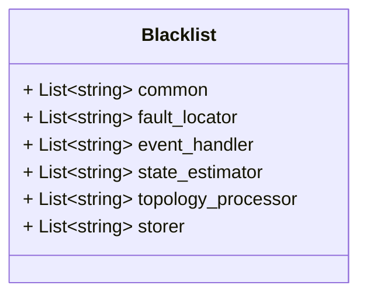

# blacklist.proto

**Package: zaphiro.platform.v1**

<!-- markdownlint-disable --> 
Messages to support coordination among processes/services in the platform.

> [!WARNING] 
> 
> These messages are only for internal use in the platform and are not intended to be used by external services.

## Imports

| Import | Description |
|--------|-------------|

## Options

| Name       | Value         | Description |
|------------|---------------|-------------|
| go_package | ./platform/v1 |             |

### zaphiro.platform.v1 Diagram

### Blacklist Diagram

## Message: Blacklist

**FQN**: zaphiro.platform.v1.Blacklist

A Blacklist of measurement to ignore.
* Headers used in RabbitMQ:
* `id` (string): id of the `Blacklist` message (a random uuid).
* `producerId` (string): the id of the producer of the list.
* `timestampId` (int64): the creation Unix msec timestamp.

| Field                | Ordinal | Type     | Label    | Description                                                                |
|----------------------|---------|----------|----------|----------------------------------------------------------------------------|
| `common`             | 1       | `string` | Repeated | The set of measurements to be blacklisted common to all services           |
| `fault_locator`      | 2       | `string` | Repeated | The set of measurements to be blacklisted specific for fault locator       |
| `event_handler`      | 3       | `string` | Repeated | The set of measurements to be blacklisted specific for event handler       |
| `state_estimator`    | 4       | `string` | Repeated | The set of measurements to be blacklisted specific for state estimator     |
| `topology_processor` | 5       | `string` | Repeated | The set of measurements to be blacklisted specific for topology processor  |
| `storer`             | 6       | `string` | Repeated | The set of measurements to be blacklisted specific for storer              |

<!-- Created by: Proto Diagram Tool -->
<!-- https://github.com/GoogleCloudPlatform/proto-gen-md-diagrams -->
