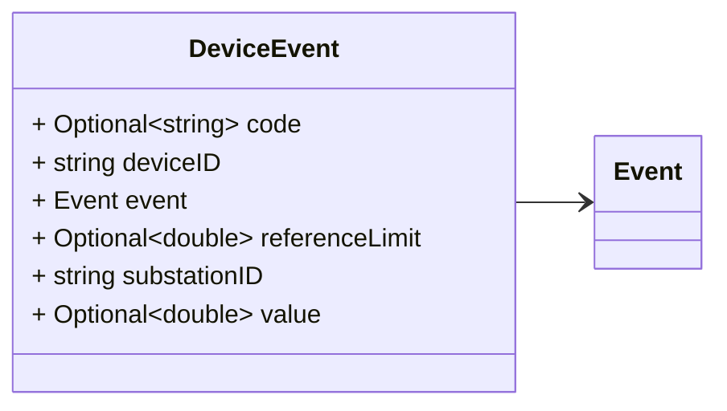
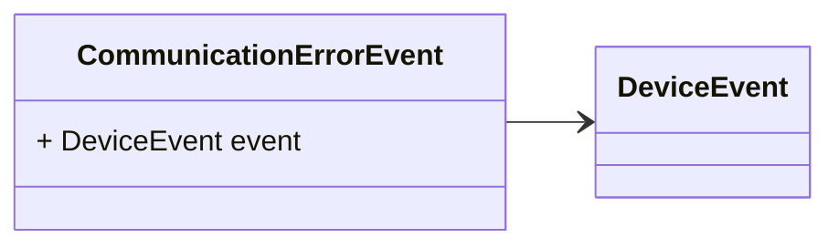
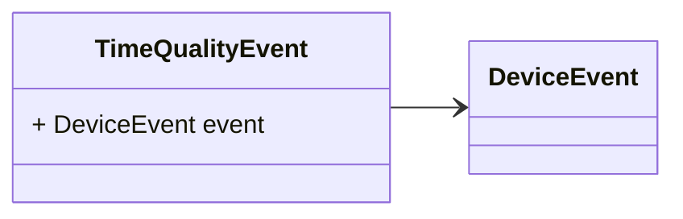
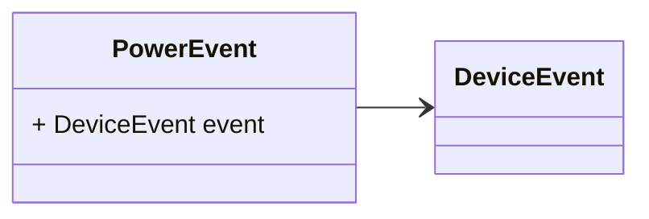
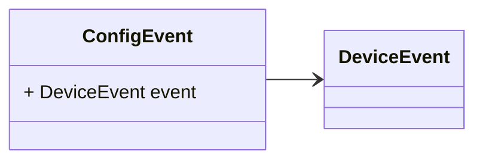
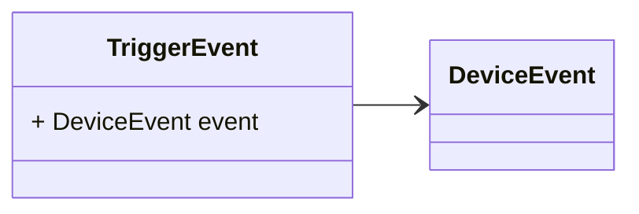
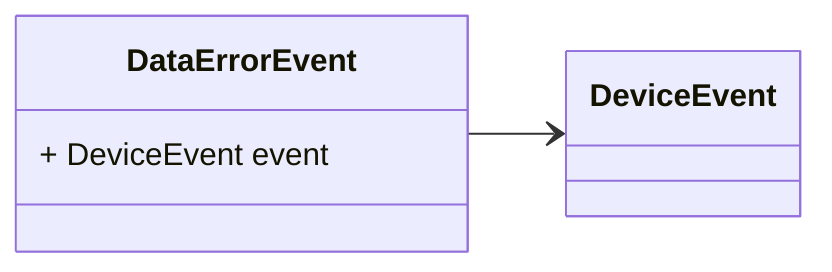

# Package: grid.v1

<!-- markdownlint-disable -->
Messages to support device event detection in the platform. Device events are sub classes of Events.

## Imports

| Import              | Description |
|---------------------|-------------|
| grid/v1/event.proto |             |

## Options

| Name       | Value     | Description |
|------------|-----------|-------------|
| go_package | ./grid/v1 |             |

### DeviceEvent Diagram

### CommunicationErrorEvent Diagram

### TimeQualityEvent Diagram

### SyncStatusEvent Diagram

### PowerEvent Diagram

### ConfigEvent Diagram

### TriggerEvent Diagram

### DataErrorEvent Diagram

## Message: DeviceEvent

**FQN**: grid.v1.DeviceEvent

A device event.
Headers used in rabbitMQ:
* `id`: id of the `Event`
* `type`: always `Event` - used for routing.
* `eventType`: the specific type of `DeviceEvent`, this is required in addition 
 to `type` for de-serialization of the messages.
* `sourceId`: the id of the source (e.g. a PMU) that generated the event.
* `timestampId`: related measurement Unix msec timestamp (if any)

| Field            | Ordinal | Type     | Label    | Description                                               |
|------------------|---------|----------|----------|-----------------------------------------------------------|
| `code`           | 6       | `string` | Optional | The device event code (or the mapped string)              |
| `deviceID`       | 2       | `string` |          | The ID of the device where the event occurred.            |
| `event`          | 1       | `Event`  |          | The base event message                                    |
| `referenceLimit` | 5       | `double` | Optional | The reference limit or expected value.                    |
| `substationID`   | 3       | `string` |          | The ID of the substation where the event occurred.        |
| `value`          | 4       | `double` | Optional | The measured / estimated value in relation to the event.  |

## Message: CommunicationErrorEvent

**FQN**: grid.v1.CommunicationErrorEvent

| Field   | Ordinal | Type          | Label | Description                    |
|---------|---------|---------------|-------|--------------------------------|
| `event` | 1       | `DeviceEvent` |       | The base device event message  |

## Message: TimeQualityEvent

**FQN**: grid.v1.TimeQualityEvent

| Field   | Ordinal | Type          | Label | Description                    |
|---------|---------|---------------|-------|--------------------------------|
| `event` | 1       | `DeviceEvent` |       | The base device event message  |

## Message: SyncStatusEvent

**FQN**: grid.v1.SyncStatusEvent

| Field   | Ordinal | Type          | Label | Description                    |
|---------|---------|---------------|-------|--------------------------------|
| `event` | 1       | `DeviceEvent` |       | The base device event message  |

## Message: PowerEvent

**FQN**: grid.v1.PowerEvent

| Field   | Ordinal | Type          | Label | Description                    |
|---------|---------|---------------|-------|--------------------------------|
| `event` | 1       | `DeviceEvent` |       | The base device event message  |

## Message: ConfigEvent

**FQN**: grid.v1.ConfigEvent

| Field   | Ordinal | Type          | Label | Description                    |
|---------|---------|---------------|-------|--------------------------------|
| `event` | 1       | `DeviceEvent` |       | The base device event message  |

## Message: TriggerEvent

**FQN**: grid.v1.TriggerEvent

| Field   | Ordinal | Type          | Label | Description                    |
|---------|---------|---------------|-------|--------------------------------|
| `event` | 1       | `DeviceEvent` |       | The base device event message  |

## Message: DataErrorEvent

**FQN**: grid.v1.DataErrorEvent

| Field   | Ordinal | Type          | Label | Description                    |
|---------|---------|---------------|-------|--------------------------------|
| `event` | 1       | `DeviceEvent` |       | The base device event message  |

<!-- Created by: Proto Diagram Tool -->
<!-- https://github.com/GoogleCloudPlatform/proto-gen-md-diagrams -->
