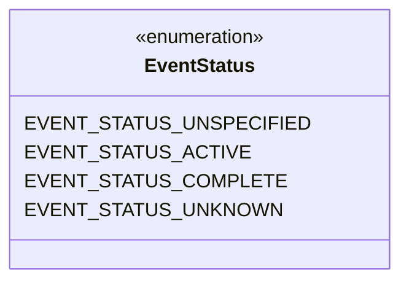
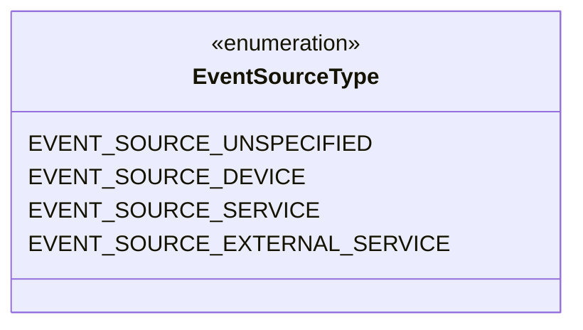
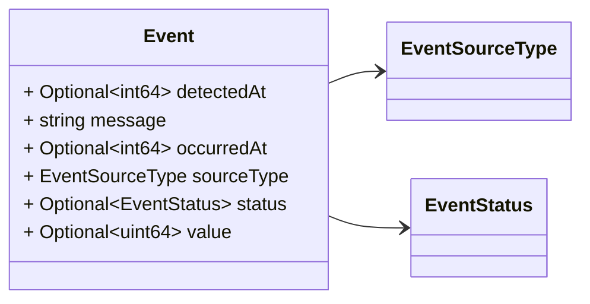

# Package: grid.v1

<!-- markdownlint-disable --> Messages to support event detection in the platform. The event detected may be originated from different sources: devices (e.g. a PMU, RTU), services (e.g. state estimator), or an external service (e.g. SCADA).  

## Imports

| Import | Description |
|--------|-------------|

## Options

| Name       | Value     | Description |
|------------|-----------|-------------|
| go_package | ./grid/v1 |             |

## Enum: EventStatus

FQN: grid.v1.EventStatus

The collection of Event Status defined so far. 

| Name                     | Ordinal | Description                                                                     |
|--------------------------|---------|---------------------------------------------------------------------------------|
| EVENT_STATUS_UNSPECIFIED | 0       | No status defined                                                               |
| EVENT_STATUS_ACTIVE      | 1       | Event is still active                                                           |
| EVENT_STATUS_COMPLETE    | 2       | Event is completed                                                              |
| EVENT_STATUS_UNKNOWN     | 3       | Information available don't allow us to know if the even is active or complete  |

## Enum: EventSourceType

FQN: grid.v1.EventSourceType

 

| Name                          | Ordinal | Description                                                                           |
|-------------------------------|---------|---------------------------------------------------------------------------------------|
| EVENT_SOURCE_UNSPECIFIED      | 0       | No source type defined                                                                |
| EVENT_SOURCE_DEVICE           | 1       | The source of the event was a device (e.g. PMU)                                       |
| EVENT_SOURCE_SERVICE          | 2       | The source of the event was a service (e.g. state estimator)                          |
| EVENT_SOURCE_EXTERNAL_SERVICE | 3       | The source of the event was a service external to SynchroGuard platform (e.g. SCADA)  |

### EventStatus Diagram

### EventSourceType Diagram

### Event Diagram

## Message: Event

FQN: grid.v1.Event

A generic event. Headers used in rabbitMQ (only if not sent as part of `DataSet`): * `id`: id of the `Event` * `type`: always `Event` * `sourceId`: the id of the source (e.g. a PMU) that generated the event. * `timestampId`: related measurement Unix msec timestamp (if any)  

| Field      | Ordinal | Type            | Label    | Description                                                |
|------------|---------|-----------------|----------|------------------------------------------------------------|
| detectedAt | 3       | int64           | Optional | The time of detection of the event (Unix msec timestamp).  |
| message    | 5       | string          |          | Event message.                                             |
| occurredAt | 2       | int64           | Optional | The time of occurency of the event (Unix msec timestamp).  |
| sourceType | 1       | EventSourceType |          | The type of data see `DataType` enum.                      |
| status     | 6       | EventStatus     | Optional | The status of the event.                                   |
| value      | 4       | uint64          | Optional | The data value casted to uint64.                           |

<!-- Created by: Proto Diagram Tool -->
<!-- https://github.com/GoogleCloudPlatform/proto-gen-md-diagrams -->
