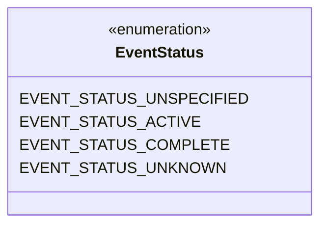
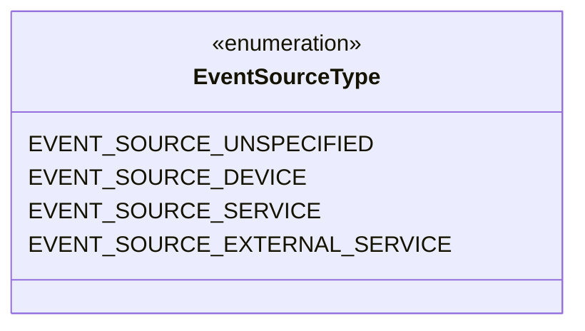
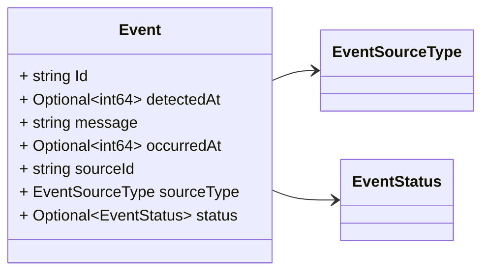

# Package: grid.v1

<!-- markdownlint-disable -->
Messages to support event detection in the platform.
The event detected may be originated from different sources: devices (e.g. a PMU, RTU), services (e.g. state estimator), or an external service (e.g. SCADA).

## Imports

| Import | Description |
|--------|-------------|

## Options

| Name       | Value     | Description |
|------------|-----------|-------------|
| go_package | ./grid/v1 |             |

## Enum: EventStatus

**FQN**: grid.v1.EventStatus

The collection of Event Status defined so far.

| Name                       | Ordinal | Description                                                                     |
|----------------------------|---------|---------------------------------------------------------------------------------|
| `EVENT_STATUS_UNSPECIFIED` | 0       | No status defined                                                               |
| `EVENT_STATUS_ACTIVE`      | 1       | Event is still active                                                           |
| `EVENT_STATUS_COMPLETE`    | 2       | Event is completed                                                              |
| `EVENT_STATUS_UNKNOWN`     | 3       | Information available don't allow us to know if the even is active or complete  |

## Enum: EventSourceType

**FQN**: grid.v1.EventSourceType

| Name                            | Ordinal | Description                                                                           |
|---------------------------------|---------|---------------------------------------------------------------------------------------|
| `EVENT_SOURCE_UNSPECIFIED`      | 0       | No source type defined                                                                |
| `EVENT_SOURCE_DEVICE`           | 1       | The source of the event was a device (e.g. PMU)                                       |
| `EVENT_SOURCE_SERVICE`          | 2       | The source of the event was a service (e.g. state estimator)                          |
| `EVENT_SOURCE_EXTERNAL_SERVICE` | 3       | The source of the event was a service external to SynchroGuard platform (e.g. SCADA)  |

### EventStatus Diagram

### EventSourceType Diagram

### Event Diagram

## Message: Event

**FQN**: grid.v1.Event

A generic event.
Headers used in rabbitMQ (only if not sent as part of `DataSet`):
* `id`: id of the `Event`
* `type`: always `Event`
* `sourceId`: the id of the source (e.g. a PMU) that generated the event.
* `timestampId`: related measurement Unix msec timestamp (if any)

| Field        | Ordinal | Type              | Label    | Description                                                  |
|--------------|---------|-------------------|----------|--------------------------------------------------------------|
| `Id`         | 1       | `string`          |          | The uuid of the event.                                       |
| `detectedAt` | 5       | `int64`           | Optional | The time of detection of the event (Unix msec timestamp).    |
| `message`    | 6       | `string`          |          | Event message.                                               |
| `occurredAt` | 4       | `int64`           | Optional | The time of occurency of the event (Unix msec timestamp).    |
| `sourceId`   | 2       | `string`          |          | The id of the source (e.g. a PMU) that generated the event.  |
| `sourceType` | 3       | `EventSourceType` |          | The type of data see `DataType` enum.                        |
| `status`     | 7       | `EventStatus`     | Optional | The status of the event.                                     |

<!-- Created by: Proto Diagram Tool -->
<!-- https://github.com/GoogleCloudPlatform/proto-gen-md-diagrams -->
