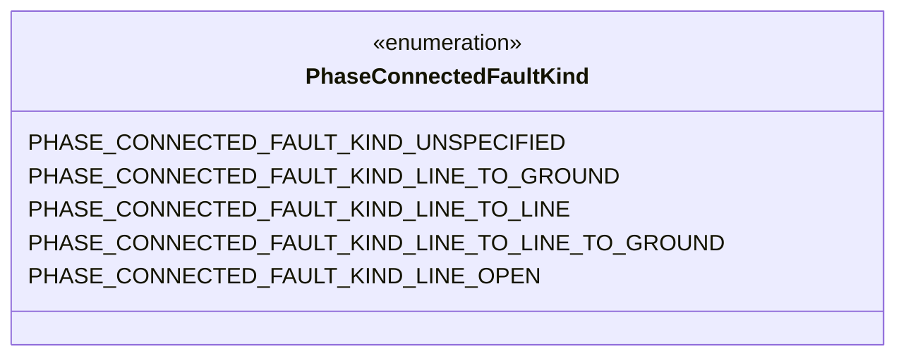
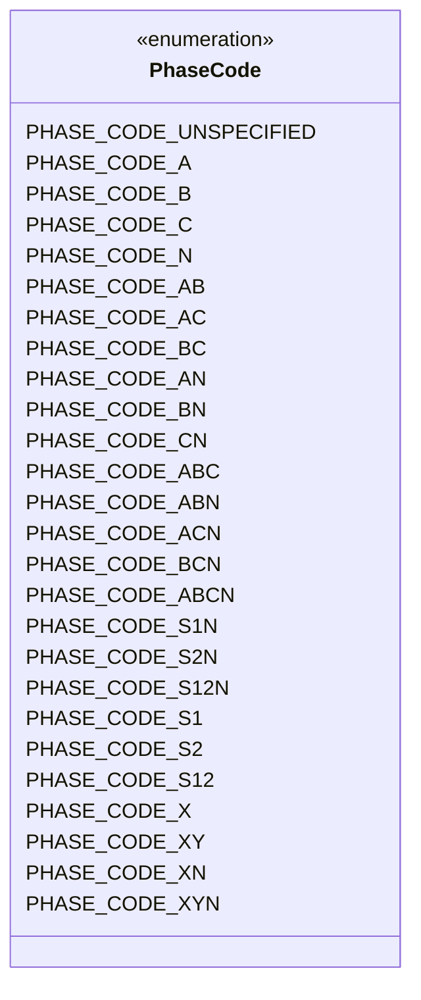
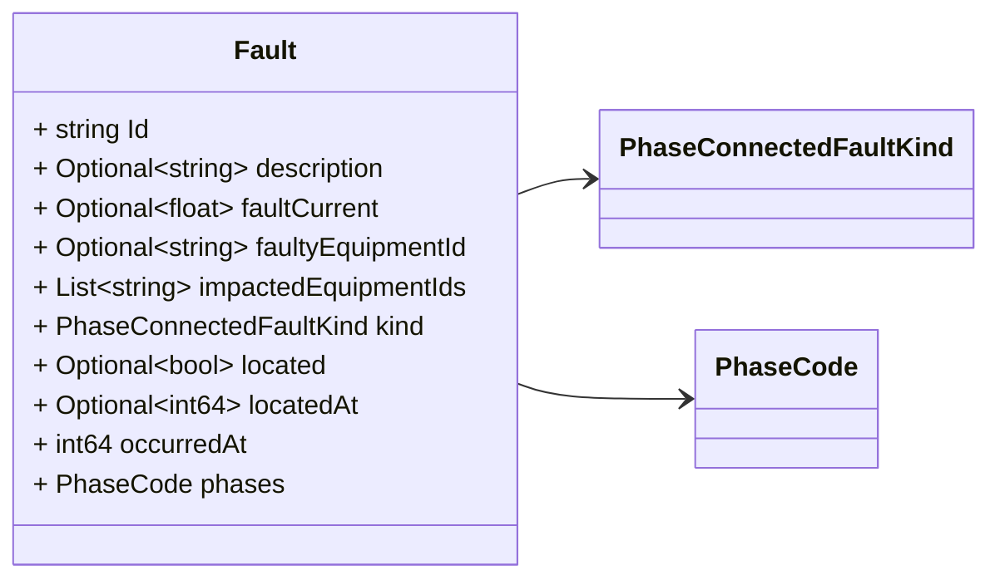
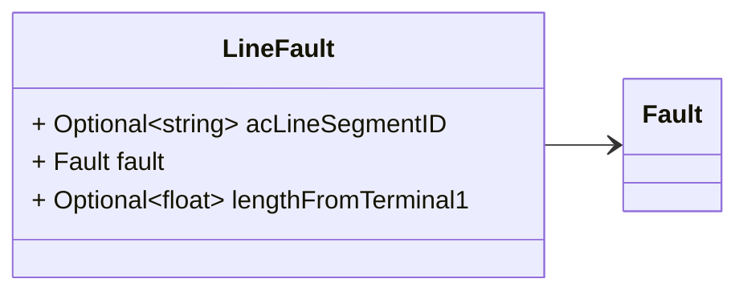
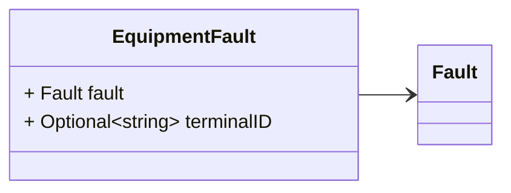

# Package: grid.v1

<!-- markdownlint-disable -->
Messages describing faults.

## Imports

| Import | Description |
|--------|-------------|

## Options

| Name       | Value     | Description |
|------------|-----------|-------------|
| go_package | ./grid/v1 |             |

## Enum: PhaseConnectedFaultKind

**FQN**: grid.v1.PhaseConnectedFaultKind

 The type of fault connection among phases.

 This message is modeled after [CIM PhaseConnectedFaultKind](https://zepben.github.io/evolve/docs/cim/cim100/TC57CIM/IEC61970/Base/Faults/PhaseConnectedFaultKind).

| Name                                                | Ordinal | Description                                                                                                                                                                                                                                                                                                                                                                                                 |
|-----------------------------------------------------|---------|-------------------------------------------------------------------------------------------------------------------------------------------------------------------------------------------------------------------------------------------------------------------------------------------------------------------------------------------------------------------------------------------------------------|
| `PHASE_CONNECTED_FAULT_KIND_UNSPECIFIED`            | 0       |                                                                                                                                                                                                                                                                                                                                                                                                             |
| `PHASE_CONNECTED_FAULT_KIND_LINE_TO_GROUND`         | 1       | The fault connects the indicated phases to ground. The line to line fault impedance is not used and assumed infinite. The full ground impedance is connected between each phase specified in the fault and ground, but not between the phases.                                                                                                                                                              |
| `PHASE_CONNECTED_FAULT_KIND_LINE_TO_LINE`           | 2       | The fault connects the specified phases together without a connection to ground. The ground impedance of this fault is ignored. The line to line impedance is connected between each of the phases specified in the fault. For example three times for a three phase fault, one time for a two phase fault. A single phase fault should not be specified.                                                   |
| `PHASE_CONNECTED_FAULT_KIND_LINE_TO_LINE_TO_GROUND` | 3       | The fault connects the indicated phases to ground and to each other. The line to line impedance is connected between each of the phases specified in the fault in a full mesh. For example three times for a three phase fault, one time for a two phase fault. A single phase fault should not be specified. The full ground impedance is connected between each phase specified in the fault and ground.  |
| `PHASE_CONNECTED_FAULT_KIND_LINE_OPEN`              | 4       | The fault is when the conductor path is broken between two terminals. Additional coexisting faults may be required if the broken conductor also causes connections to grounds or other lines or phases.                                                                                                                                                                                                     |

## Enum: PhaseCode

**FQN**: grid.v1.PhaseCode

An unordered enumeration of phase identifiers. Allows designation of phases for both transmission and distribution equipment, circuits and loads. The enumeration, by itself, does not describe how the phases are connected together or connected to ground. Ground is not explicitly denoted as a phase.
Residential and small commercial loads are often served from single-phase, or split-phase, secondary circuits. For the example of s12N, phases 1 and 2 refer to hot wires that are 180 degrees out of phase, while N refers to the neutral wire. Through single-phase transformer connections, these secondary circuits may be served from one or two of the primary phases A, B, and C. For three-phase loads, use the A, B, C phase codes instead of s12N.
The integer values are from IEC 61968-9 to support revenue metering applications.

This message is modeled after [CIM PhaseCode](https://zepben.github.io/evolve/docs/cim/evolve/IEC61970/Base/Core/PhaseCode/).

| Name                     | Ordinal | Description                                   |
|--------------------------|---------|-----------------------------------------------|
| `PHASE_CODE_UNSPECIFIED` | 0       | No phases specified.                          |
| `PHASE_CODE_A`           | 1       | Phase A.                                      |
| `PHASE_CODE_B`           | 2       | Phase B.                                      |
| `PHASE_CODE_C`           | 3       | Phase C.                                      |
| `PHASE_CODE_N`           | 4       | Neutral phase.                                |
| `PHASE_CODE_AB`          | 5       | Phases A and B.                               |
| `PHASE_CODE_AC`          | 6       | Phases A and C.                               |
| `PHASE_CODE_BC`          | 7       | Phases B and C.                               |
| `PHASE_CODE_AN`          | 8       | Phases A and neutral.                         |
| `PHASE_CODE_BN`          | 9       | Phases B and neutral.                         |
| `PHASE_CODE_CN`          | 10      | Phases C and neutral.                         |
| `PHASE_CODE_ABC`         | 11      | Phases A, B, and C.                           |
| `PHASE_CODE_ABN`         | 12      | Phases A, B, and neutral.                     |
| `PHASE_CODE_ACN`         | 13      | Phases A, C and neutral.                      |
| `PHASE_CODE_BCN`         | 14      | Phases B, C, and neutral.                     |
| `PHASE_CODE_ABCN`        | 15      | Phases A, B, C, and N.                        |
| `PHASE_CODE_S1N`         | 16      | Secondary phase 1 and neutral.                |
| `PHASE_CODE_S2N`         | 17      | Secondary phase 2 and neutral.                |
| `PHASE_CODE_S12N`        | 18      | Secondary phases 1, 2, and neutral.           |
| `PHASE_CODE_S1`          | 19      | Secondary phase 1.                            |
| `PHASE_CODE_S2`          | 20      | Secondary phase 2.                            |
| `PHASE_CODE_S12`         | 21      | Secondary phase 1 and 2.                      |
| `PHASE_CODE_X`           | 22      | Unknown non-neutral phase.                    |
| `PHASE_CODE_XY`          | 23      | Two unknown non-neutral phases.               |
| `PHASE_CODE_XN`          | 24      | Unknown non-neutral phase plus neutral.       |
| `PHASE_CODE_XYN`         | 25      | Two unknown non-neutral phases plus neutral.  |

### PhaseConnectedFaultKind Diagram

### PhaseCode Diagram

### Fault Diagram

### LineFault Diagram

### EquipmentFault Diagram

## Message: Fault

**FQN**: grid.v1.Fault

Abnormal condition causing current flow through conducting equipment, such as caused by equipment failure or short circuits from objects not typically modelled (for example, a tree falling on a line).

This message is modeled after [CIM Fault](https://zepben.github.io/evolve/docs/cim/cim100/TC57CIM/IEC61970/Base/Faults/Fault) according to the extensions defined in the [fault-data-storage](https://github.com/zaphiro-technologies/architecture/blob/main/features/31-fault-data-storage.md#data-structures) feature.

Headers used in rabbitMQ:
* `id`: id of the `Fault`
* `type`: always `Fault`
* `producerId`: the id of the producer (e.g. a PMU) linked to the notification.

| Field                  | Ordinal | Type                      | Label    | Description                                                                                                                 |
|------------------------|---------|---------------------------|----------|-----------------------------------------------------------------------------------------------------------------------------|
| `Id`                   | 1       | `string`                  |          | The textual id of the fault.                                                                                                      |
| `description`          | 2       | `string`                  | Optional | The textual description of the fault.                                                                                       |
| `faultCurrent`         | 8       | `float`                   | Optional | The current associated to the fault.                                                                                        |
| `faultyEquipmentId`    | 6       | `string`                  | Optional | The equipment with the fault.                                                                                               |
| `impactedEquipmentIds` | 10      | `string`                  | Repeated | The set of IDs of equipments impacted by the fault.                                                                         |
| `kind`                 | 3       | `PhaseConnectedFaultKind` |          | The kind of phase fault.                                                                                                    |
| `located`              | 9       | `bool`                    | Optional | Was the fault located.                                                                                                      |
| `locatedAt`            | 7       | `int64`                   | Optional | The time when the fault was located.                                                                                        |
| `occurredAt`           | 5       | `int64`                   |          | The date and time at which the fault occurred (Unix msec timestamp).                                                        |
| `phases`               | 4       | `PhaseCode`               |          | The phases participating in the fault. The fault connections into these phases are further specified by the type of fault.  |

## Message: LineFault

**FQN**: grid.v1.LineFault

A fault that occurs on an AC line segment at some point along the length.

This message is modeled after [CIM LineFault](https://zepben.github.io/evolve/docs/cim/cim100/TC57CIM/IEC61970/Base/Faults/LineFault) according to the extensions defined in the [fault-data-storage](https://github.com/zaphiro-technologies/architecture/blob/main/features/31-fault-data-storage.md#data-structures) feature.

Headers used in rabbitMQ:
* `id`: id of the `Fault`
* `type`: always `LineFault`
* `producerId`: the id of the producer (e.g. a PMU) linked to the notification.

| Field                 | Ordinal | Type     | Label    | Description                                                                                                                    |
|-----------------------|---------|----------|----------|--------------------------------------------------------------------------------------------------------------------------------|
| `acLineSegmentID`     | 3       | `string` | Optional | The line segment of this line fault.                                                                                           |
| `fault`               | 1       | `Fault`  |          | The base fault message.                                                                                                        |
| `lengthFromTerminal1` | 2       | `float`  | Optional | The length to the place where the fault is located starting from terminal with sequence number 1 of the faulted line segment.  |

## Message: EquipmentFault

**FQN**: grid.v1.EquipmentFault

A fault applied at the terminal, external to the equipment. This class is not used to specify faults internal to the equipment.

This message is modeled after [CIM EquipmentFault](https://zepben.github.io/evolve/docs/cim/cim100/TC57CIM/IEC61970/Base/Faults/EquipmentFault) according to the extensions defined in the [fault-data-storage](https://github.com/zaphiro-technologies/architecture/blob/main/features/31-fault-data-storage.md#data-structures) feature.

Headers used in rabbitMQ:
* `id`: id of the `EquipmentFault`
* `type`: always `LineFault`
* `producerId`: the id of the producer (e.g. a PMU) linked to the notification.

| Field        | Ordinal | Type     | Label    | Description                                                        |
|--------------|---------|----------|----------|--------------------------------------------------------------------|
| `fault`      | 1       | `Fault`  |          | The base fault message.                                            |
| `terminalID` | 2       | `string` | Optional | The terminal connecting to the bus to which the fault is applied.  |

<!-- Created by: Proto Diagram Tool -->
<!-- https://github.com/GoogleCloudPlatform/proto-gen-md-diagrams -->
