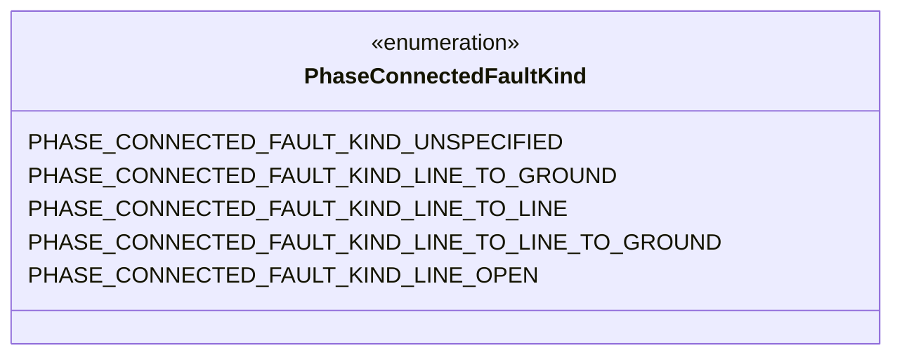
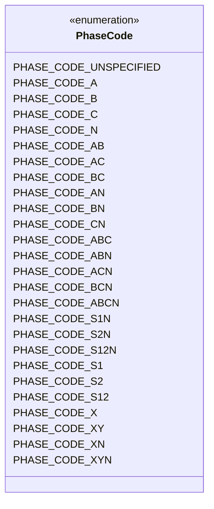
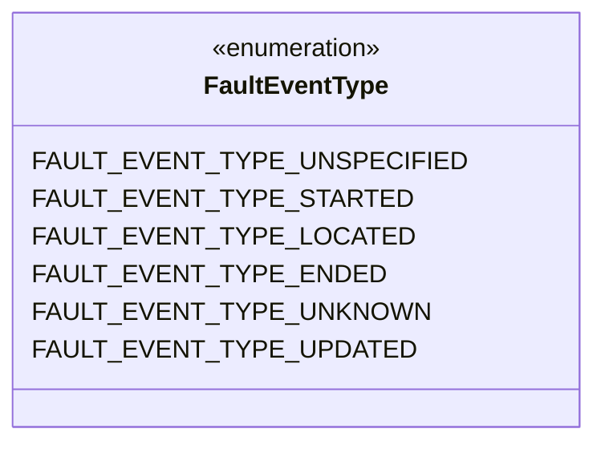
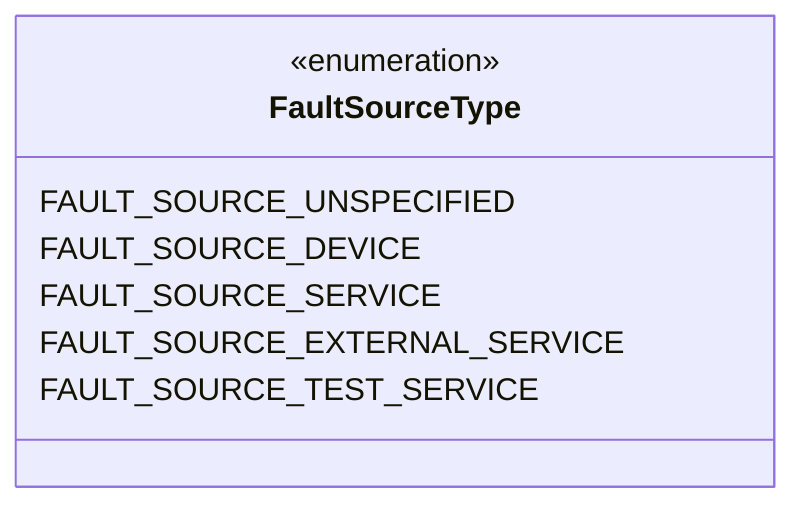
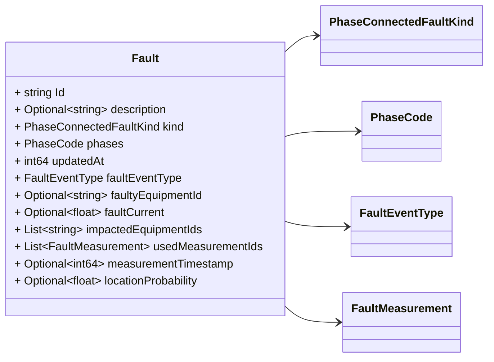
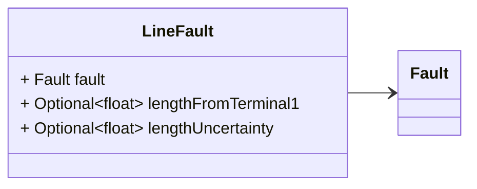
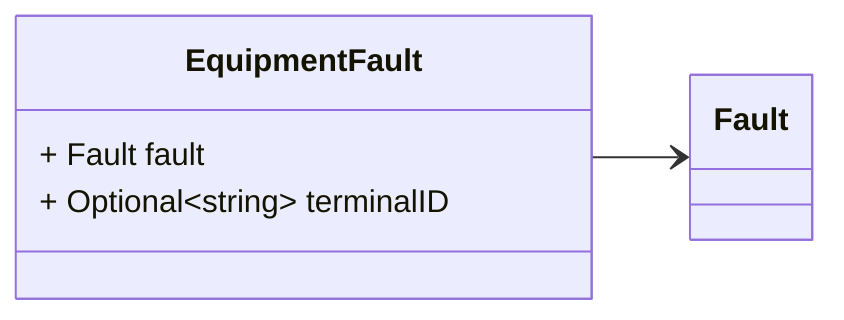
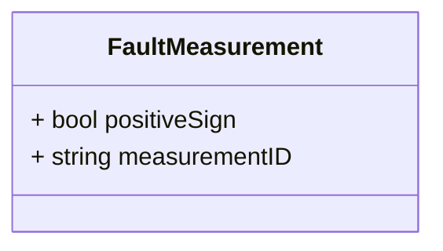

# Package: zaphiro.grid.v1

Copyright 2024 Zaphiro Technologies Licensed under the Apache License, Version
2.0 (the "License"); you may not use this file except in compliance with the
License. You may obtain a copy of the License at
http://www.apache.org/licenses/LICENSE-2.0 Unless required by applicable law or
agreed to in writing, software distributed under the License is distributed on
an "AS IS" BASIS, WITHOUT WARRANTIES OR CONDITIONS OF ANY KIND, either express
or implied. See the License for the specific language governing permissions and
limitations under the License. <!-- markdownlint-disable --> Messages describing
faults.

## Imports

| Import | Description |
| ------ | ----------- |

## Options

| Name       | Value     | Description |
| ---------- | --------- | ----------- |
| go_package | ./grid/v1 |             |

## Enum: PhaseConnectedFaultKind

**FQN**: zaphiro.grid.v1.PhaseConnectedFaultKind

The type of fault connection among phases.

This message is modeled after
[CIM PhaseConnectedFaultKind](https://zepben.github.io/evolve/docs/cim/cim100/TC57CIM/IEC61970/Base/Faults/PhaseConnectedFaultKind).

| Name                                                | Ordinal | Description                                                                                                                                                                                                                                                                                                                                                                                                           |
| --------------------------------------------------- | ------- | --------------------------------------------------------------------------------------------------------------------------------------------------------------------------------------------------------------------------------------------------------------------------------------------------------------------------------------------------------------------------------------------------------------------- |
| `PHASE_CONNECTED_FAULT_KIND_UNSPECIFIED`            | 0       |                                                                                                                                                                                                                                                                                                                                                                                                                       |
| `PHASE_CONNECTED_FAULT_KIND_LINE_TO_GROUND`         | 1       | The fault connects the indicated phases to ground. The line to line fault _ impedance is not used and assumed infinite. The full ground impedance is _ connected between each phase specified in the fault and ground, but not \* between the phases.                                                                                                                                                                 |
| `PHASE_CONNECTED_FAULT_KIND_LINE_TO_LINE`           | 2       | The fault connects the specified phases together without a connection to _ ground. The ground impedance of this fault is ignored. The line to line _ impedance is connected between each of the phases specified in the fault. _ For example three times for a three phase fault, one time for a two phase _ fault. A single phase fault should not be specified.                                                     |
| `PHASE_CONNECTED_FAULT_KIND_LINE_TO_LINE_TO_GROUND` | 3       | The fault connects the indicated phases to ground and to each other. The _ line to line impedance is connected between each of the phases specified in _ the fault in a full mesh. For example three times for a three phase fault, _ one time for a two phase fault. A single phase fault should not be _ specified. The full ground impedance is connected between each phase \* specified in the fault and ground. |
| `PHASE_CONNECTED_FAULT_KIND_LINE_OPEN`              | 4       | The fault is when the conductor path is broken between two terminals. _ Additional coexisting faults may be required if the broken conductor also _ causes connections to grounds or other lines or phases.                                                                                                                                                                                                           |

## Enum: PhaseCode

**FQN**: zaphiro.grid.v1.PhaseCode

An unordered enumeration of phase identifiers. Allows designation of phases for
both transmission and distribution equipment, circuits and loads. The
enumeration, by itself, does not describe how the phases are connected together
or connected to ground. Ground is not explicitly denoted as a phase. Residential
and small commercial loads are often served from single-phase, or split-phase,
secondary circuits. For the example of s12N, phases 1 and 2 refer to hot wires
that are 180 degrees out of phase, while N refers to the neutral wire. Through
single-phase transformer connections, these secondary circuits may be served
from one or two of the primary phases A, B, and C. For three-phase loads, use
the A, B, C phase codes instead of s12N. The integer values are from IEC 61968-9
to support revenue metering applications.

This message is modeled after
[CIM PhaseCode](https://zepben.github.io/evolve/docs/cim/cim100/TC57CIM/IEC61970/Base/Core/PhaseCode/).

| Name                     | Ordinal | Description                                  |
| ------------------------ | ------- | -------------------------------------------- |
| `PHASE_CODE_UNSPECIFIED` | 0       | No phases specified.                         |
| `PHASE_CODE_A`           | 1       | Phase A.                                     |
| `PHASE_CODE_B`           | 2       | Phase B.                                     |
| `PHASE_CODE_C`           | 3       | Phase C.                                     |
| `PHASE_CODE_N`           | 4       | Neutral phase.                               |
| `PHASE_CODE_AB`          | 5       | Phases A and B.                              |
| `PHASE_CODE_AC`          | 6       | Phases A and C.                              |
| `PHASE_CODE_BC`          | 7       | Phases B and C.                              |
| `PHASE_CODE_AN`          | 8       | Phases A and neutral.                        |
| `PHASE_CODE_BN`          | 9       | Phases B and neutral.                        |
| `PHASE_CODE_CN`          | 10      | Phases C and neutral.                        |
| `PHASE_CODE_ABC`         | 11      | Phases A, B, and C.                          |
| `PHASE_CODE_ABN`         | 12      | Phases A, B, and neutral.                    |
| `PHASE_CODE_ACN`         | 13      | Phases A, C and neutral.                     |
| `PHASE_CODE_BCN`         | 14      | Phases B, C, and neutral.                    |
| `PHASE_CODE_ABCN`        | 15      | Phases A, B, C, and N.                       |
| `PHASE_CODE_S1N`         | 16      | Secondary phase 1 and neutral.               |
| `PHASE_CODE_S2N`         | 17      | Secondary phase 2 and neutral.               |
| `PHASE_CODE_S12N`        | 18      | Secondary phases 1, 2, and neutral.          |
| `PHASE_CODE_S1`          | 19      | Secondary phase 1.                           |
| `PHASE_CODE_S2`          | 20      | Secondary phase 2.                           |
| `PHASE_CODE_S12`         | 21      | Secondary phase 1 and 2.                     |
| `PHASE_CODE_X`           | 22      | Unknown non-neutral phase.                   |
| `PHASE_CODE_XY`          | 23      | Two unknown non-neutral phases.              |
| `PHASE_CODE_XN`          | 24      | Unknown non-neutral phase plus neutral.      |
| `PHASE_CODE_XYN`         | 25      | Two unknown non-neutral phases plus neutral. |

## Enum: FaultEventType

**FQN**: zaphiro.grid.v1.FaultEventType

The collection of Fault Event Types defined so far.

| Name                           | Ordinal | Description                                                                     |
| ------------------------------ | ------- | ------------------------------------------------------------------------------- |
| `FAULT_EVENT_TYPE_UNSPECIFIED` | 0       | No status defined                                                               |
| `FAULT_EVENT_TYPE_STARTED`     | 1       | Fault started                                                                   |
| `FAULT_EVENT_TYPE_LOCATED`     | 2       | Fault located                                                                   |
| `FAULT_EVENT_TYPE_ENDED`       | 3       | Fault ended                                                                     |
| `FAULT_EVENT_TYPE_UNKNOWN`     | 4       | Information available don't allow us to know if the Fault is active or complete |
| `FAULT_EVENT_TYPE_UPDATED`     | 5       | Fault data requires to be updated                                               |

## Enum: FaultSourceType

**FQN**: zaphiro.grid.v1.FaultSourceType

| Name                            | Ordinal | Description                                                                          |
| ------------------------------- | ------- | ------------------------------------------------------------------------------------ |
| `FAULT_SOURCE_UNSPECIFIED`      | 0       | No source type defined                                                               |
| `FAULT_SOURCE_DEVICE`           | 1       | The source of the fault was a device (e.g. PMU)                                      |
| `FAULT_SOURCE_SERVICE`          | 2       | The source of the fault was a service (e.g. state estimator)                         |
| `FAULT_SOURCE_EXTERNAL_SERVICE` | 3       | The source of the fault was a service external to SynchroGuard platform (e.g. SCADA) |
| `FAULT_SOURCE_TEST_SERVICE`     | 4       | The source of the fault was a service in test mode.                                  |

### PhaseConnectedFaultKind Diagram

### PhaseCode Diagram

### FaultEventType Diagram

### FaultSourceType Diagram

### Fault Diagram

### LineFault Diagram

### EquipmentFault Diagram

### FaultMeasurement Diagram

## Message: Fault

**FQN**: zaphiro.grid.v1.Fault

Abnormal condition causing current flow through conducting equipment, such as
caused by equipment failure or short circuits from objects not typically
modelled (for example, a tree falling on a line).

This message is modelled after
[CIM Fault](https://zepben.github.io/evolve/docs/cim/cim100/TC57CIM/IEC61970/Base/Faults/Fault)
according to the extensions defined in the
[fault-data-storage](https://github.com/zaphiro-technologies/architecture/blob/main/features/31-fault-data-storage.md#data-structures)
feature.

Faults messages represent events linked to a given fault (identified by the id).
From the point of view of storage the sequence of events may be handled in a way
that does not map totally to the single event, e.g. by combining multiple events
in a single database row.

When a fault is detected, an `Fault` message event of type
`FAULT_EVENT_TYPE_STARTED` is generated, when a fault is located (and multiple
locations can occur for the same fault) and a `Fault` event message of type
`FAULT_EVENT_TYPE_LOCATED` is generated. When a fault ends, a `Fault` event
message of type `FAULT_EVENT_TYPE_ENDED` is generated. Certain fields of the
Fault event message may be populated only in case of event type
`FAULT_EVENT_TYPE_LOCATED` (i.e. `locationProbability`, `measurementTimestamp`).

Headers used in rabbitMQ:

- `id` (string): id of the `Fault`
- `type` (string): always `Fault`
- `producerId` (string): the id of the producer (e.g. a PMU) linked to the
  notification.
- `sourceType` (string): the Fault source type. cf enum EventSourceType

| Field                  | Ordinal | Type                      | Label    | Description                                                                                                                |
| ---------------------- | ------- | ------------------------- | -------- | -------------------------------------------------------------------------------------------------------------------------- |
| `Id`                   | 1       | `string`                  |          | The textual id of the fault.                                                                                               |
| `description`          | 2       | `string`                  | Optional | The textual description of the fault.                                                                                      |
| `kind`                 | 3       | `PhaseConnectedFaultKind` |          | The kind of phase fault.                                                                                                   |
| `phases`               | 4       | `PhaseCode`               |          | The phases participating in the fault. The fault connections into these phases are further specified by the type of fault. |
| `updatedAt`            | 5       | `int64`                   |          | The date and time at which the fault started/located/ended depending on the Fault Status (Unix msec timestamp).            |
| `faultEventType`       | 6       | `FaultEventType`          |          | The type of the fault event.                                                                                               |
| `faultyEquipmentId`    | 7       | `string`                  | Optional | The equipment with the fault.                                                                                              |
| `faultCurrent`         | 8       | `float`                   | Optional | The current associated to the fault.                                                                                       |
| `impactedEquipmentIds` | 9       | `string`                  | Repeated | The set of IDs of equipments impacted by the fault.                                                                        |
| `usedMeasurementIds`   | 10      | `FaultMeasurement`        | Repeated | The set of measurements used to locate the fault.                                                                          |
| `measurementTimestamp` | 11      | `int64`                   | Optional | The timestamp of the measurements used to compute the fault location.                                                      |
| `locationProbability`  | 12      | `float`                   | Optional | The probability associated to the location. (This is relevant because multiple locations can be returned for a fault)      |

## Message: LineFault

**FQN**: zaphiro.grid.v1.LineFault

A fault that occurs on an AC line segment at some point along the length.

This message is modeled after
[CIM LineFault](https://zepben.github.io/evolve/docs/cim/cim100/TC57CIM/IEC61970/Base/Faults/LineFault)
according to the extensions defined in the
[fault-data-storage](https://github.com/zaphiro-technologies/architecture/blob/main/features/31-fault-data-storage.md#data-structures)
feature.

Certain fields of the `LineFault` event message may be populated only in case of
event type `FAULT_EVENT_TYPE_LOCATED` (i.e. `lengthFromTerminal1`,
`lengthUncertainty`).

Headers used in rabbitMQ:

- `id` (string): id of the `Fault`
- `type` (string): always `LineFault`
- `producerId` (string): the id of the producer (e.g. a PMU) linked to the
  notification.
- `sourceType` (string): the Fault source type. cf enum EventSourceType

| Field                 | Ordinal | Type    | Label    | Description                                                                                                                   |
| --------------------- | ------- | ------- | -------- | ----------------------------------------------------------------------------------------------------------------------------- |
| `fault`               | 1       | `Fault` |          | The base fault message.                                                                                                       |
| `lengthFromTerminal1` | 2       | `float` | Optional | The length to the place where the fault is located starting from terminal with sequence number 1 of the faulted line segment. |
| `lengthUncertainty`   | 3       | `float` | Optional | The +/- uncertainty on the reported length.                                                                                   |

## Message: EquipmentFault

**FQN**: zaphiro.grid.v1.EquipmentFault

A fault applied at the terminal, external to the equipment. This class is not
used to specify faults internal to the equipment.

This message is modeled after
[CIM EquipmentFault](https://zepben.github.io/evolve/docs/cim/cim100/TC57CIM/IEC61970/Base/Faults/EquipmentFault)
according to the extensions defined in the
[fault-data-storage](https://github.com/zaphiro-technologies/architecture/blob/main/features/31-fault-data-storage.md#data-structures)
feature.

Certain fields of the `EquipmentFault` event message may be populated only in
case of event type `FAULT_EVENT_TYPE_LOCATED` (i.e. `terminalID`).

Headers used in rabbitMQ:

- `id` (string): id of the `Fault`
- `type` (string): always `EquipmentFault`
- `producerId` (string): the id of the producer (e.g. a PMU) linked to the
  notification.
- `sourceType` (string): the Fault source type. cf enum EventSourceType

| Field        | Ordinal | Type     | Label    | Description                                                       |
| ------------ | ------- | -------- | -------- | ----------------------------------------------------------------- |
| `fault`      | 1       | `Fault`  |          | The base fault message.                                           |
| `terminalID` | 2       | `string` | Optional | The terminal connecting to the bus to which the fault is applied. |

## Message: FaultMeasurement

**FQN**: zaphiro.grid.v1.FaultMeasurement

| Field           | Ordinal | Type     | Label | Description                                                                  |
| --------------- | ------- | -------- | ----- | ---------------------------------------------------------------------------- |
| `positiveSign`  | 1       | `bool`   |       | The sign to be used for the measurement (`true` positive, `false` negative). |
| `measurementID` | 2       | `string` |       | The ID of a measurement used to locate the fault.                            |

<!-- Created by: Proto Diagram Tool -->
<!-- https://github.com/GoogleCloudPlatform/proto-gen-md-diagrams -->
