# Package: zaphiro.grid.v1

<!-- markdownlint-disable -->
Messages to support grid event detection in the platform. Grid events are sub classes of Events.

## Imports

| Import                      | Description |
|-----------------------------|-------------|
| zaphiro/grid/v1/event.proto |             |
| zaphiro/grid/v1/fault.proto |             |

## Options

| Name       | Value     | Description |
|------------|-----------|-------------|
| go_package | ./grid/v1 |             |

### GridEvent Diagram

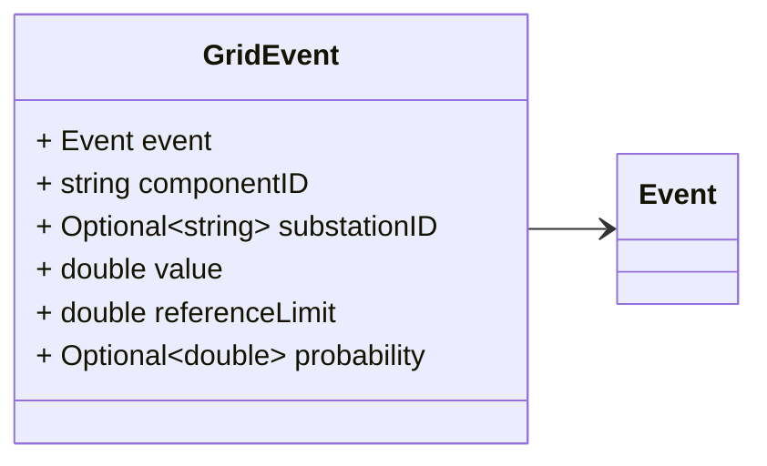
### VoltageEvent Diagram

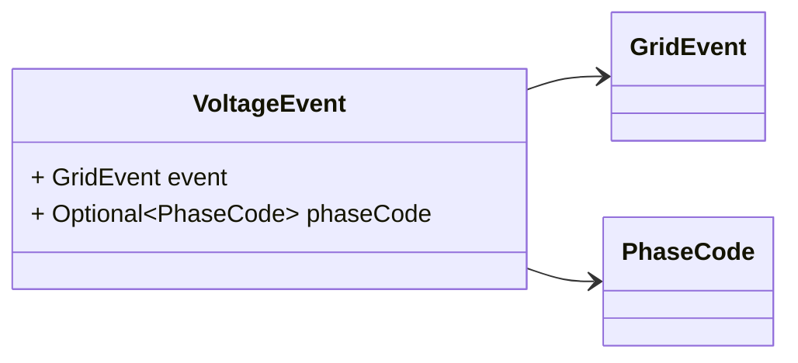
### CurrentEvent Diagram

### PhaseEvent Diagram

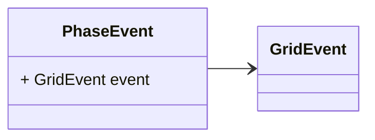
### FrequencyEvent Diagram

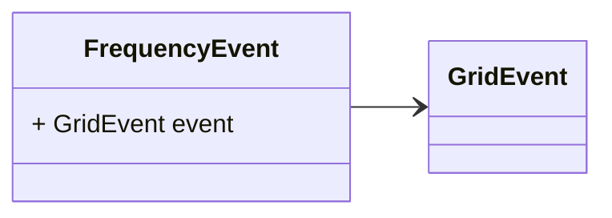
### LineCongestion Diagram

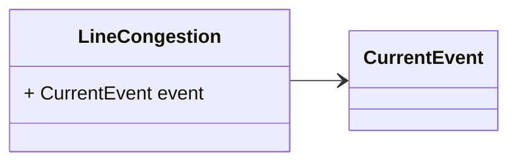
### TransformerCongestion Diagram

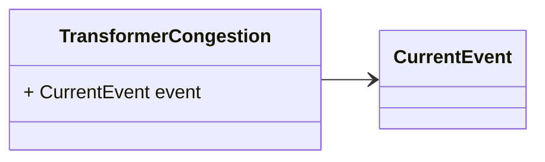
### VoltageUnbalance Diagram

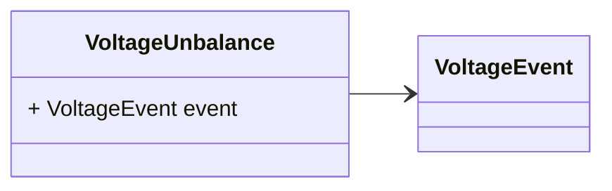
### VoltageDip Diagram

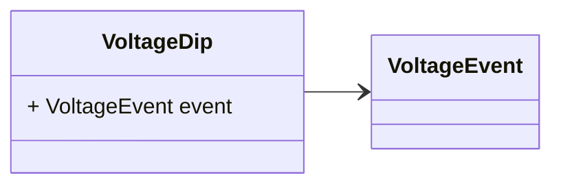
### VoltageInterruption Diagram

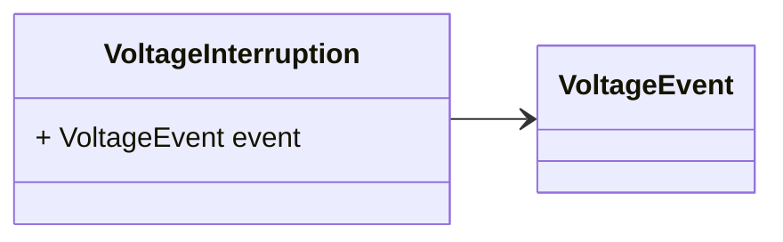
### VoltageSwell Diagram

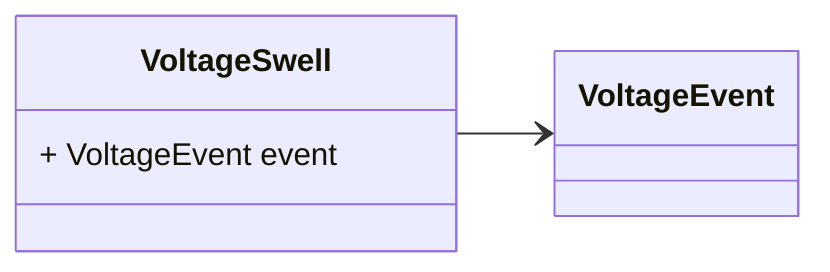
### VoltageLimit Diagram

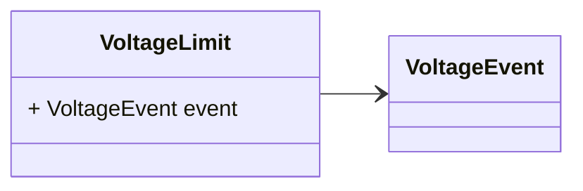
### VoltageRapidChange Diagram

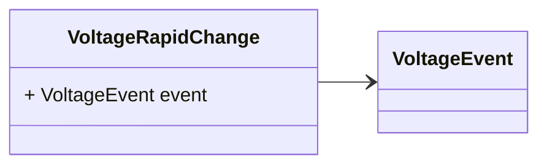
### OverFrequency Diagram

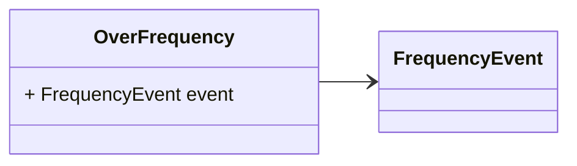
### UnderFrequency Diagram

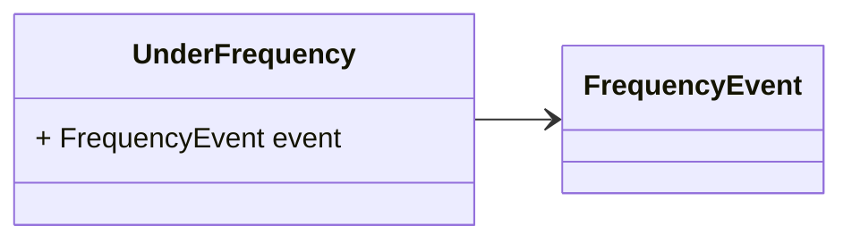
### SteadyOscillation Diagram

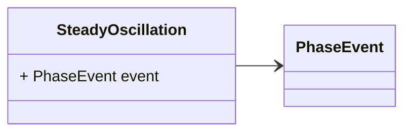
### TransientOscillation Diagram

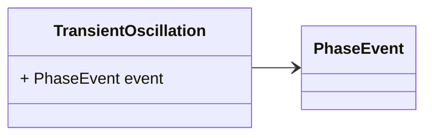

## Message: GridEvent

**FQN**: zaphiro.grid.v1.GridEvent

A grid event.
Headers used in rabbitMQ (only if not sent as part of `DataSet`):
* `id` (string): id of the `Event`
* `type` (string): always `Event` - used for routing.
* `eventType` (string): the specific type of `GridEvent`, this is required in addition 
 to `type` for de-serialization of the messages.
* `sourceId` (string): the id of the source (e.g. a PMU) that generated the event.
* `timestampId` (int64): related measurement Unix msec timestamp (if any)

| Field            | Ordinal | Type     | Label    | Description                                                                                                                                                           |
|------------------|---------|----------|----------|-----------------------------------------------------------------------------------------------------------------------------------------------------------------------|
| `event`          | 1       | `Event`  |          | The base event message                                                                                                                                                |
| `componentID`    | 2       | `string` |          | The ID of the component where the event occurred.                                                                                                                     |
| `substationID`   | 3       | `string` | Optional | The ID of the substation where the event occurred.                                                                                                                    |
| `value`          | 4       | `double` |          | The measured / estimated value in relation to the event (e.g. in the case of a `VoltageEvent` is the voltage, in the case of a `CurrentEvent` is the current event).  |
| `referenceLimit` | 5       | `double` |          | The reference limit or expected value.                                                                                                                                |
| `probability`    | 6       | `double` | Optional | The probability that the event actually occurred.                                                                                                                     |

## Message: VoltageEvent

**FQN**: zaphiro.grid.v1.VoltageEvent

| Field       | Ordinal | Type        | Label    | Description                            |
|-------------|---------|-------------|----------|----------------------------------------|
| `event`     | 1       | `GridEvent` |          | The base grid event message            |
| `phaseCode` | 2       | `PhaseCode` | Optional | The phase for which the event occured  |

## Message: CurrentEvent

**FQN**: zaphiro.grid.v1.CurrentEvent

| Field   | Ordinal | Type        | Label | Description                  |
|---------|---------|-------------|-------|------------------------------|
| `event` | 1       | `GridEvent` |       | The base grid event message  |

## Message: PhaseEvent

**FQN**: zaphiro.grid.v1.PhaseEvent

| Field   | Ordinal | Type        | Label | Description                  |
|---------|---------|-------------|-------|------------------------------|
| `event` | 1       | `GridEvent` |       | The base grid event message  |

## Message: FrequencyEvent

**FQN**: zaphiro.grid.v1.FrequencyEvent

| Field   | Ordinal | Type        | Label | Description                  |
|---------|---------|-------------|-------|------------------------------|
| `event` | 1       | `GridEvent` |       | The base grid event message  |

## Message: LineCongestion

**FQN**: zaphiro.grid.v1.LineCongestion

| Field   | Ordinal | Type           | Label | Description                          |
|---------|---------|----------------|-------|--------------------------------------|
| `event` | 1       | `CurrentEvent` |       | The base current grid event message  |

## Message: TransformerCongestion

**FQN**: zaphiro.grid.v1.TransformerCongestion

| Field   | Ordinal | Type           | Label | Description                          |
|---------|---------|----------------|-------|--------------------------------------|
| `event` | 1       | `CurrentEvent` |       | The base current grid event message  |

## Message: VoltageUnbalance

**FQN**: zaphiro.grid.v1.VoltageUnbalance

| Field   | Ordinal | Type           | Label | Description                          |
|---------|---------|----------------|-------|--------------------------------------|
| `event` | 1       | `VoltageEvent` |       | The base voltage grid event message  |

## Message: VoltageDip

**FQN**: zaphiro.grid.v1.VoltageDip

| Field   | Ordinal | Type           | Label | Description                          |
|---------|---------|----------------|-------|--------------------------------------|
| `event` | 1       | `VoltageEvent` |       | The base voltage grid event message  |

## Message: VoltageInterruption

**FQN**: zaphiro.grid.v1.VoltageInterruption

| Field   | Ordinal | Type           | Label | Description                          |
|---------|---------|----------------|-------|--------------------------------------|
| `event` | 1       | `VoltageEvent` |       | The base voltage grid event message  |

## Message: VoltageSwell

**FQN**: zaphiro.grid.v1.VoltageSwell

| Field   | Ordinal | Type           | Label | Description                          |
|---------|---------|----------------|-------|--------------------------------------|
| `event` | 1       | `VoltageEvent` |       | The base voltage grid event message  |

## Message: VoltageLimit

**FQN**: zaphiro.grid.v1.VoltageLimit

| Field   | Ordinal | Type           | Label | Description                          |
|---------|---------|----------------|-------|--------------------------------------|
| `event` | 1       | `VoltageEvent` |       | The base voltage grid event message  |

## Message: VoltageRapidChange

**FQN**: zaphiro.grid.v1.VoltageRapidChange

| Field   | Ordinal | Type           | Label | Description                          |
|---------|---------|----------------|-------|--------------------------------------|
| `event` | 1       | `VoltageEvent` |       | The base voltage grid event message  |

## Message: OverFrequency

**FQN**: zaphiro.grid.v1.OverFrequency

| Field   | Ordinal | Type             | Label | Description                            |
|---------|---------|------------------|-------|----------------------------------------|
| `event` | 1       | `FrequencyEvent` |       | The base frequency grid event message  |

## Message: UnderFrequency

**FQN**: zaphiro.grid.v1.UnderFrequency

| Field   | Ordinal | Type             | Label | Description                            |
|---------|---------|------------------|-------|----------------------------------------|
| `event` | 1       | `FrequencyEvent` |       | The base frequency grid event message  |

## Message: SteadyOscillation

**FQN**: zaphiro.grid.v1.SteadyOscillation

| Field   | Ordinal | Type         | Label | Description                        |
|---------|---------|--------------|-------|------------------------------------|
| `event` | 1       | `PhaseEvent` |       | The base phase grid event message  |

## Message: TransientOscillation

**FQN**: zaphiro.grid.v1.TransientOscillation

| Field   | Ordinal | Type         | Label | Description                        |
|---------|---------|--------------|-------|------------------------------------|
| `event` | 1       | `PhaseEvent` |       | The base phase grid event message  |

<!-- Created by: Proto Diagram Tool -->
<!-- https://github.com/GoogleCloudPlatform/proto-gen-md-diagrams -->
