# Package: grid.v1

<!-- markdownlint-disable --> Messages to support grid event detection in the platform. Grid events are sub classes of Events.  

## Imports

| Import              | Description |
|---------------------|-------------|
| grid/v1/event.proto |             |
| grid/v1/fault.proto |             |

## Options

| Name       | Value     | Description |
|------------|-----------|-------------|
| go_package | ./grid/v1 |             |

### GridEvent Diagram

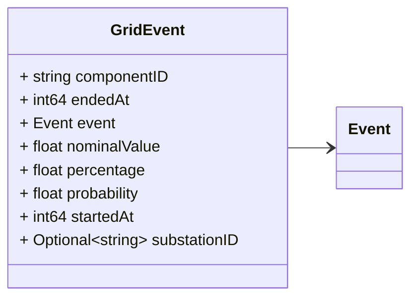
### VoltageEvent Diagram

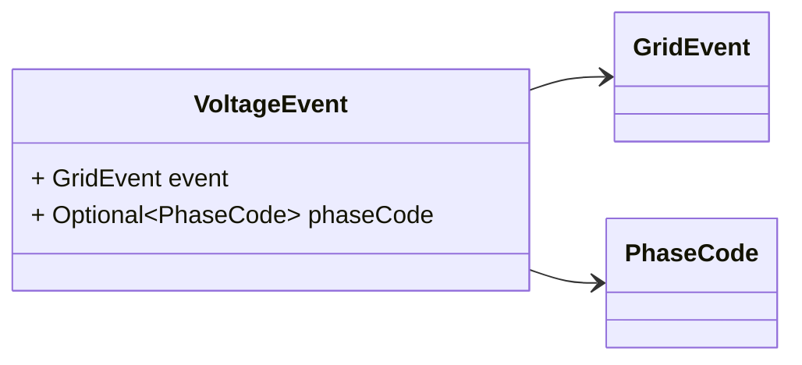
### CurrentEvent Diagram

### PhaseEvent Diagram

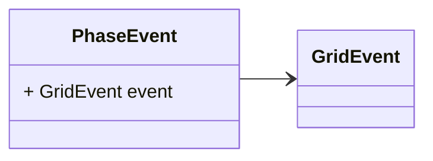
### FrequencyEvent Diagram

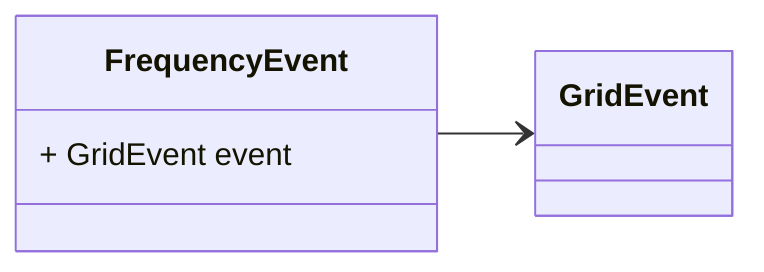
### LineCongestion Diagram

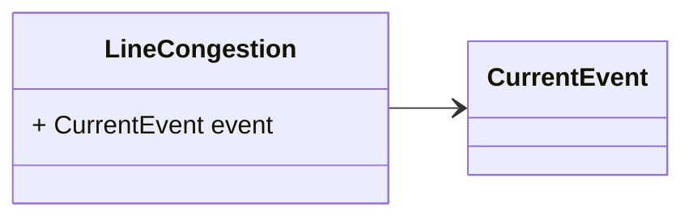
### TransformerCongestion Diagram

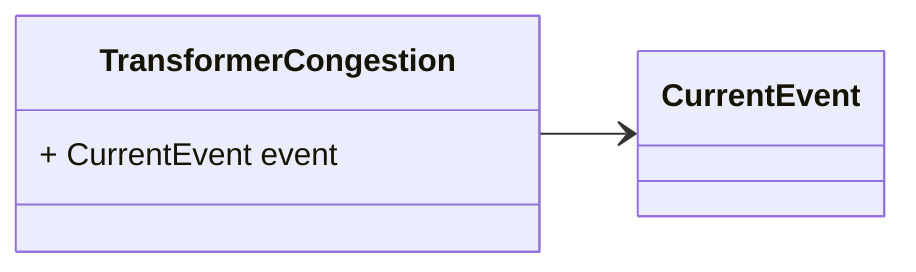
### VoltageUnbalance Diagram

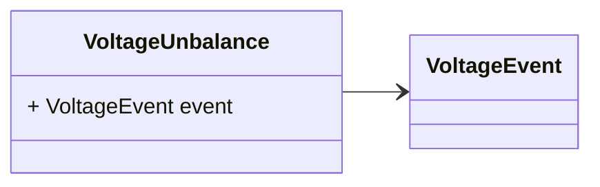
### VoltageDip Diagram

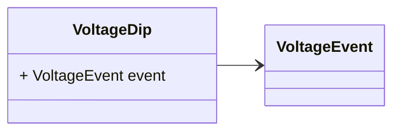
### VoltageInterruption Diagram

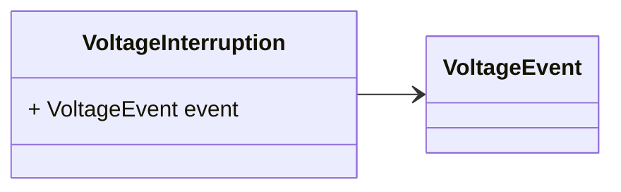
### VoltageSwell Diagram

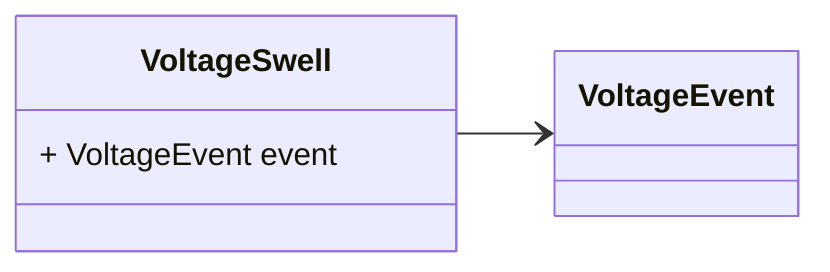
### VoltageLimit Diagram

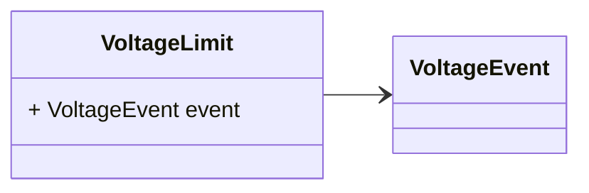
### VoltageRapidChange Diagram

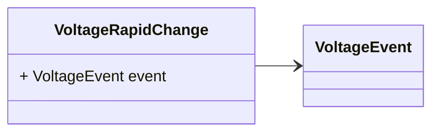
### OverFrequency Diagram

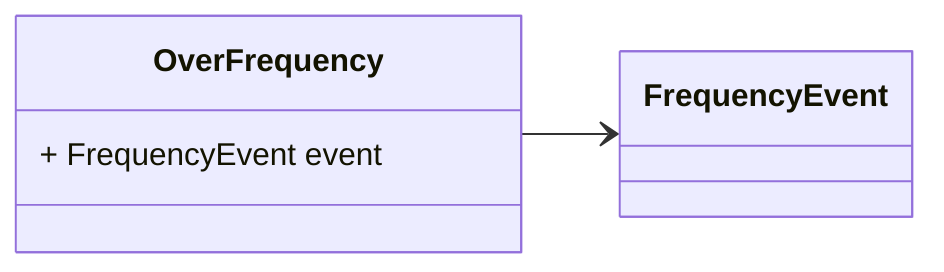
### UnderFrequency Diagram

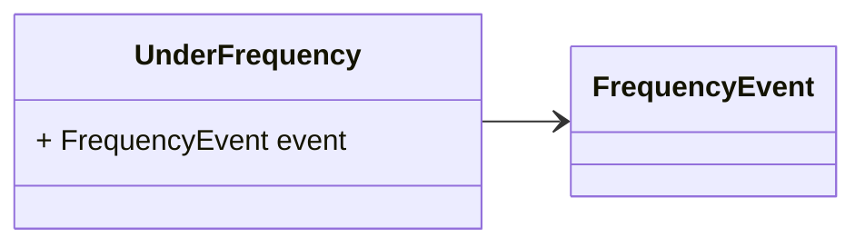
### SteadyOscillation Diagram

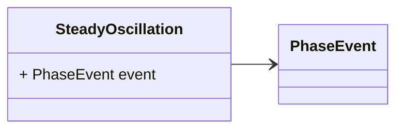
### TransientOscillation Diagram

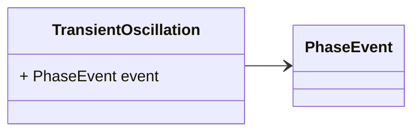

## Message: GridEvent

FQN: grid.v1.GridEvent

A grid event. Headers used in rabbitMQ (only if not sent as part of `DataSet`): * `id`: id of the `Event` * `type`: always `Event` * `sourceId`: the id of the source (e.g. a PMU) that generated the event. * `timestampId`: related measurement Unix msec timestamp (if any)  

| Field        | Ordinal | Type   | Label    | Description                                                                                                                                                           |
|--------------|---------|--------|----------|-----------------------------------------------------------------------------------------------------------------------------------------------------------------------|
| componentID  | 2       | string |          | The ID of the component where the event occurred.                                                                                                                     |
| endedAt      | 5       | int64  |          | The timestamp where the event ended.                                                                                                                                  |
| event        | 1       | Event  |          | The base event message                                                                                                                                                |
| nominalValue | 6       | float  |          | The measured / estimated value in relation to the event (e.g. in the case of a `VoltageEvent` is the voltage, in the case of a `CurrentEvent` is the current event).  |
| percentage   | 7       | float  |          | The percentage reached by the value compared to the reference limit or expected value.                                                                                |
| probability  | 8       | float  |          | The probability that the event actually occurred.                                                                                                                     |
| startedAt    | 4       | int64  |          | The timestamp where the event started (should be equal to timestampId in header).                                                                                     |
| substationID | 3       | string | Optional | The ID of the substation where the event occurred.                                                                                                                    |

## Message: VoltageEvent

FQN: grid.v1.VoltageEvent

 

| Field     | Ordinal | Type      | Label    | Description |
|-----------|---------|-----------|----------|-------------|
| event     | 1       | GridEvent |          |             |
| phaseCode | 2       | PhaseCode | Optional |             |

## Message: CurrentEvent

FQN: grid.v1.CurrentEvent

 

| Field | Ordinal | Type      | Label | Description |
|-------|---------|-----------|-------|-------------|
| event | 1       | GridEvent |       |             |

## Message: PhaseEvent

FQN: grid.v1.PhaseEvent

 

| Field | Ordinal | Type      | Label | Description |
|-------|---------|-----------|-------|-------------|
| event | 1       | GridEvent |       |             |

## Message: FrequencyEvent

FQN: grid.v1.FrequencyEvent

 

| Field | Ordinal | Type      | Label | Description |
|-------|---------|-----------|-------|-------------|
| event | 1       | GridEvent |       |             |

## Message: LineCongestion

FQN: grid.v1.LineCongestion

 

| Field | Ordinal | Type         | Label | Description |
|-------|---------|--------------|-------|-------------|
| event | 1       | CurrentEvent |       |             |

## Message: TransformerCongestion

FQN: grid.v1.TransformerCongestion

 

| Field | Ordinal | Type         | Label | Description |
|-------|---------|--------------|-------|-------------|
| event | 1       | CurrentEvent |       |             |

## Message: VoltageUnbalance

FQN: grid.v1.VoltageUnbalance

 

| Field | Ordinal | Type         | Label | Description |
|-------|---------|--------------|-------|-------------|
| event | 1       | VoltageEvent |       |             |

## Message: VoltageDip

FQN: grid.v1.VoltageDip

 

| Field | Ordinal | Type         | Label | Description |
|-------|---------|--------------|-------|-------------|
| event | 1       | VoltageEvent |       |             |

## Message: VoltageInterruption

FQN: grid.v1.VoltageInterruption

 

| Field | Ordinal | Type         | Label | Description |
|-------|---------|--------------|-------|-------------|
| event | 1       | VoltageEvent |       |             |

## Message: VoltageSwell

FQN: grid.v1.VoltageSwell

 

| Field | Ordinal | Type         | Label | Description |
|-------|---------|--------------|-------|-------------|
| event | 1       | VoltageEvent |       |             |

## Message: VoltageLimit

FQN: grid.v1.VoltageLimit

 

| Field | Ordinal | Type         | Label | Description |
|-------|---------|--------------|-------|-------------|
| event | 1       | VoltageEvent |       |             |

## Message: VoltageRapidChange

FQN: grid.v1.VoltageRapidChange

 

| Field | Ordinal | Type         | Label | Description |
|-------|---------|--------------|-------|-------------|
| event | 1       | VoltageEvent |       |             |

## Message: OverFrequency

FQN: grid.v1.OverFrequency

 

| Field | Ordinal | Type           | Label | Description |
|-------|---------|----------------|-------|-------------|
| event | 1       | FrequencyEvent |       |             |

## Message: UnderFrequency

FQN: grid.v1.UnderFrequency

 

| Field | Ordinal | Type           | Label | Description |
|-------|---------|----------------|-------|-------------|
| event | 1       | FrequencyEvent |       |             |

## Message: SteadyOscillation

FQN: grid.v1.SteadyOscillation

 

| Field | Ordinal | Type       | Label | Description |
|-------|---------|------------|-------|-------------|
| event | 1       | PhaseEvent |       |             |

## Message: TransientOscillation

FQN: grid.v1.TransientOscillation

 

| Field | Ordinal | Type       | Label | Description |
|-------|---------|------------|-------|-------------|
| event | 1       | PhaseEvent |       |             |

<!-- Created by: Proto Diagram Tool -->
<!-- https://github.com/GoogleCloudPlatform/proto-gen-md-diagrams -->
