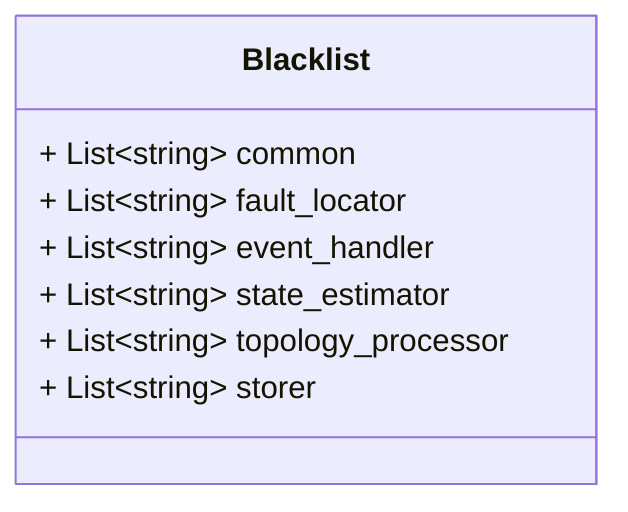

# Package: zaphiro.platform.v1

Copyright 2024 Zaphiro Technologies Licensed under the Apache License, Version
2.0 (the "License"); you may not use this file except in compliance with the
License. You may obtain a copy of the License at
http://www.apache.org/licenses/LICENSE-2.0 Unless required by applicable law or
agreed to in writing, software distributed under the License is distributed on
an "AS IS" BASIS, WITHOUT WARRANTIES OR CONDITIONS OF ANY KIND, either express
or implied. See the License for the specific language governing permissions and
limitations under the License.

<!-- markdownlint-disable -->

Messages to support coordination among processes/services in the platform.

## Imports

| Import | Description |
| ------ | ----------- |

## Options

| Name       | Value         | Description |
| ---------- | ------------- | ----------- |
| go_package | ./platform/v1 |             |

### Blacklist Diagram

## Message: Blacklist

**FQN**: zaphiro.platform.v1.Blacklist

The measurement id set to be ignored by the real time processing.

| Field                | Ordinal | Type     | Label    | Description                                                               |
| -------------------- | ------- | -------- | -------- | ------------------------------------------------------------------------- |
| `common`             | 1       | `string` | Repeated | The set of measurements to be blacklisted common to all services          |
| `fault_locator`      | 2       | `string` | Repeated | The set of measurements to be blacklisted specific for fault locator      |
| `event_handler`      | 3       | `string` | Repeated | The set of measurements to be blacklisted specific for event handler      |
| `state_estimator`    | 4       | `string` | Repeated | The set of measurements to be blacklisted specific for state estimator    |
| `topology_processor` | 5       | `string` | Repeated | The set of measurements to be blacklisted specific for topology processor |
| `storer`             | 6       | `string` | Repeated | The set of measurements to be blacklisted specific for storer             |

<!-- Created by: Proto Diagram Tool -->
<!-- https://github.com/GoogleCloudPlatform/proto-gen-md-diagrams -->
