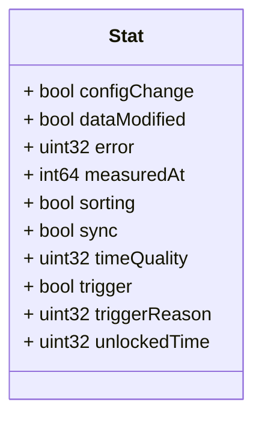

# Package: zaphiro.c37118.v1

<!-- markdownlint-disable -->
Messages to support stat data injection exchange in the platform.

## Imports

| Import | Description |
|--------|-------------|

## Options

| Name       | Value       | Description |
|------------|-------------|-------------|
| go_package | ./c37118/v1 |             |

### Stat Diagram

## Message: Stat

**FQN**: zaphiro.c37118.v1.Stat

A Stat of PMU data, check IEEE C37.118 standard for more details.
Headers used in rabbitMQ:
* `id` (string): id of the `Stat` message.
* `producerId` (string): the id of the PMU linked to the Stat.
* `timestampId` (int64): related measurement Unix msec timestamp (if any)

| Field           | Ordinal | Type     | Label | Description                                                   |
|-----------------|---------|----------|-------|---------------------------------------------------------------|
| `configChange`  | 6       | `bool`   |       | Configuration change status                                   |
| `dataModified`  | 7       | `bool`   |       | Data modification status                                      |
| `error`         | 2       | `uint32` |       | Error code uint8                                              |
| `measuredAt`    | 1       | `int64`  |       | The time of creation of the stat data (Unix msec timestamp).  |
| `sorting`       | 4       | `bool`   |       | Sorting status                                                |
| `sync`          | 3       | `bool`   |       | Synchronization status                                        |
| `timeQuality`   | 8       | `uint32` |       | Time quality uint8                                            |
| `trigger`       | 5       | `bool`   |       | Trigger status                                                |
| `triggerReason` | 10      | `uint32` |       | Trigger reason uint8                                          |
| `unlockedTime`  | 9       | `uint32` |       | Unlocked time uint8                                           |

<!-- Created by: Proto Diagram Tool -->
<!-- https://github.com/GoogleCloudPlatform/proto-gen-md-diagrams -->
