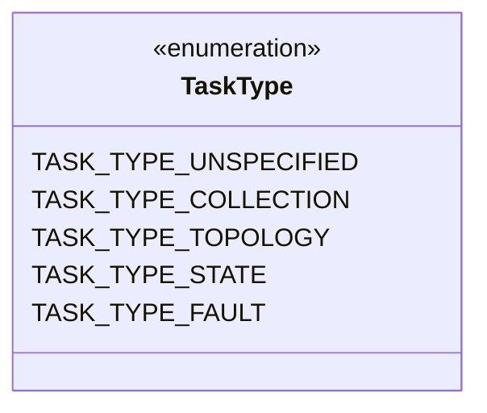
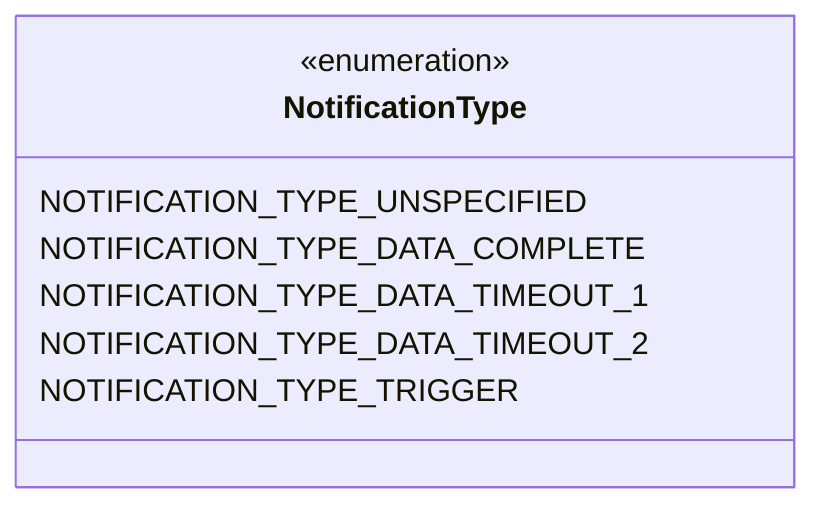
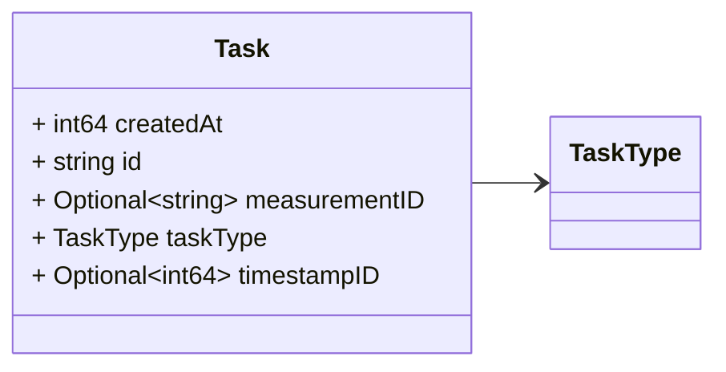
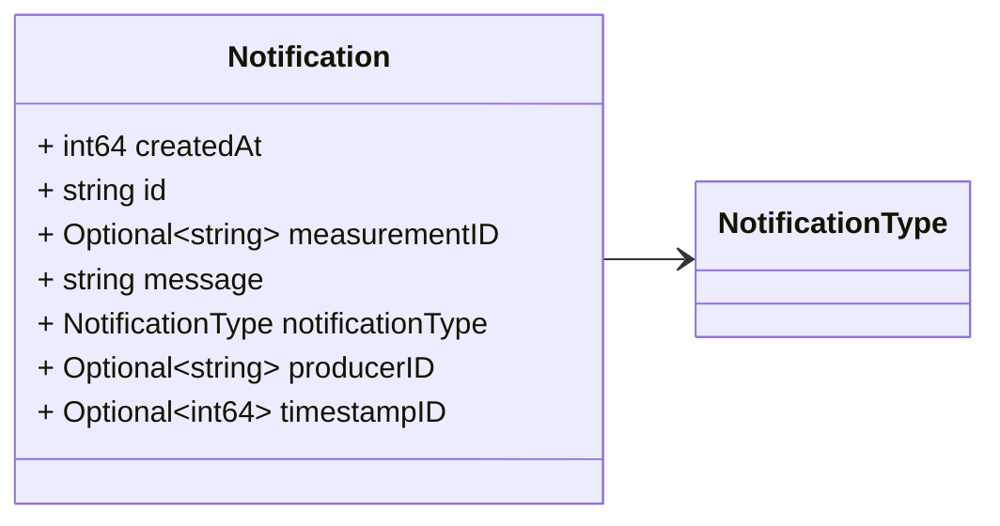

# Package: task.v1

<!-- markdownlint-disable -->  Messages to support task coordination among processes At the time being this is a proof of concept. Different changes may occurs when we actually start to event driven approach to coordinate tasks. 

## Imports

| Import | Description |
|--------|-------------|

## Options

| Name       | Value     | Description |
|------------|-----------|-------------|
| go_package | ./task/v1 |             |

## Enum: TaskType

FQN: task.v1.TaskType

The different type of tasks run by the real time processing. 

| Name                  | Ordinal | Description |
|-----------------------|---------|-------------|
| TASK_TYPE_UNSPECIFIED | 0       |             |
| TASK_TYPE_COLLECTION  | 1       |             |
| TASK_TYPE_TOPOLOGY    | 2       |             |
| TASK_TYPE_STATE       | 3       |             |
| TASK_TYPE_FAULT       | 4       |             |

## Enum: NotificationType

FQN: task.v1.NotificationType

The different type of notifications generated by the real time processing. 

| Name                             | Ordinal | Description |
|----------------------------------|---------|-------------|
| NOTIFICATION_TYPE_UNSPECIFIED    | 0       |             |
| NOTIFICATION_TYPE_DATA_COMPLETE  | 1       |             |
| NOTIFICATION_TYPE_DATA_TIMEOUT_1 | 2       |             |
| NOTIFICATION_TYPE_DATA_TIMEOUT_2 | 3       |             |
| NOTIFICATION_TYPE_TRIGGER        | 4       |             |

### TaskType Diagram

### NotificationType Diagram

### Task Diagram

### Notification Diagram

## Message: Task

FQN: task.v1.Task

A task message. 

| Field         | Ordinal | Type     | Label    | Description                               |
|---------------|---------|----------|----------|-------------------------------------------|
| createdAt     | 3       | int64    |          | Task creation time (Unix Nano timestamp)  |
| id            | 1       | string   |          | Id of the task.                           |
| measurementID | 4       | string   | Optional | Related measurement id (if any)           |
| taskType      | 2       | TaskType |          | Type of the task                          |
| timestampID   | 5       | int64    | Optional | Related measurement timestamp (if any)    |

## Message: Notification

FQN: task.v1.Notification

A notification message. Headers used in rabbitMQ: `notificationType` `producerId` `timestampID` 

| Field            | Ordinal | Type             | Label    | Description                                                                          |
|------------------|---------|------------------|----------|--------------------------------------------------------------------------------------|
| createdAt        | 3       | int64            |          | Notification creation time (Unix Nano timestamp)                                     |
| id               | 1       | string           |          | Id of the notification                                                               |
| measurementID    | 5       | string           | Optional | Related measurement id (if any)                                                      |
| message          | 4       | string           |          | Notification message, it can be a string or a integer (which maps to a enum value).  |
| notificationType | 2       | NotificationType |          | Notification type                                                                    |
| producerID       | 7       | string           | Optional | The id of the producer (e.g. a PMU) linked to the notification                       |
| timestampID      | 6       | int64            | Optional | Related measurement timestamp (if any)                                               |

<!-- Created by: Proto Diagram Tool -->
<!-- https://github.com/GoogleCloudPlatform/proto-gen-md-diagrams -->
