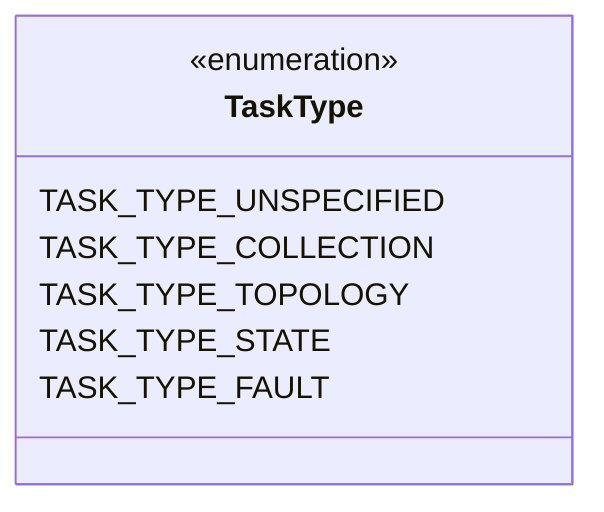
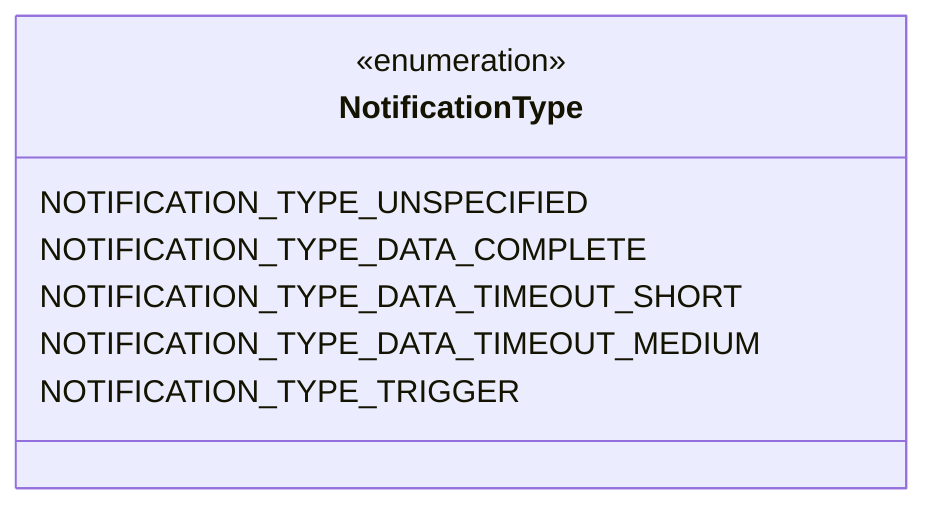
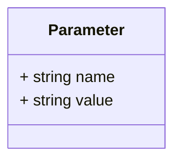
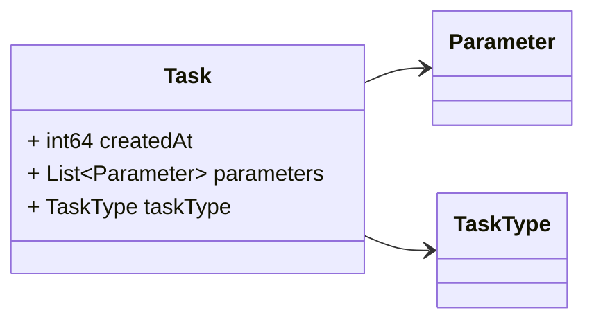
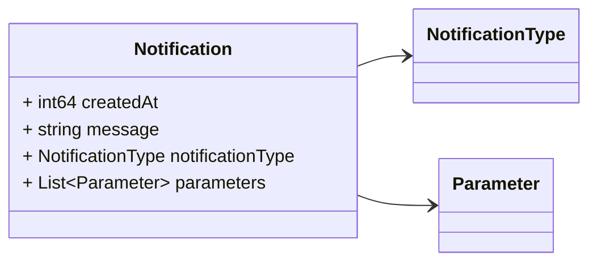

# Package: platform.v1

<!-- markdownlint-disable --> 
Messages to support coordination among processes/services in the platform.
At the time being this is a proof of concept. Different changes may occurs
when we actually start to use the event driven approach to coordinate
services.

## Imports

| Import | Description |
|--------|-------------|

## Options

| Name       | Value         | Description |
|------------|---------------|-------------|
| go_package | ./platform/v1 |             |

## Enum: TaskType

**FQN**: platform.v1.TaskType

The different type of tasks run by the real time processing.

| Name                    | Ordinal | Description |
|-------------------------|---------|-------------|
| `TASK_TYPE_UNSPECIFIED` | 0       |             |
| `TASK_TYPE_COLLECTION`  | 1       |             |
| `TASK_TYPE_TOPOLOGY`    | 2       |             |
| `TASK_TYPE_STATE`       | 3       |             |
| `TASK_TYPE_FAULT`       | 4       |             |

## Enum: NotificationType

**FQN**: platform.v1.NotificationType

The different type of notifications generated by the real time processing.

| Name                                    | Ordinal | Description |
|-----------------------------------------|---------|-------------|
| `NOTIFICATION_TYPE_UNSPECIFIED`         | 0       |             |
| `NOTIFICATION_TYPE_DATA_COMPLETE`       | 1       |             |
| `NOTIFICATION_TYPE_DATA_TIMEOUT_SHORT`  | 2       |             |
| `NOTIFICATION_TYPE_DATA_TIMEOUT_MEDIUM` | 3       |             |
| `NOTIFICATION_TYPE_TRIGGER`             | 4       |             |

### TaskType Diagram

### NotificationType Diagram

### Parameter Diagram

### Task Diagram

### Notification Diagram

## Message: Parameter

**FQN**: platform.v1.Parameter

A parameter of a `Task` or `Notification`

| Field   | Ordinal | Type     | Label | Description          |
|---------|---------|----------|-------|----------------------|
| `name`  | 1       | `string` |       | The parameter name   |
| `value` | 2       | `string` |       | The parameter value  |

## Message: Task

**FQN**: platform.v1.Task

A task message.
Headers used in rabbitMQ:
* `id`: id of the `Task`
* `type`: always `Task`
* `producerId`: the id of the producer (e.g. a PMU) linked to the notification.
* `timestampId`: related measurement Unix msec timestamp (if any)
* `taskType`: The textual representation of the task type.

| Field        | Ordinal | Type        | Label    | Description                               |
|--------------|---------|-------------|----------|-------------------------------------------|
| `createdAt`  | 2       | `int64`     |          | Task creation time (Unix msec timestamp)  |
| `parameters` | 3       | `Parameter` | Repeated |                                           |
| `taskType`   | 1       | `TaskType`  |          | Type of the task                          |

## Message: Notification

**FQN**: platform.v1.Notification

A notification message.
Headers used in rabbitMQ:
* `id`: id of the `Notification`
* `type`: always `Notification`
* `producerId`: the id of the producer (e.g. a PMU) linked to the notification.
* `timestampId`: related measurement Unix msec timestamp (if any)
* `notificationType`: The textual representation of the notification type.

| Field              | Ordinal | Type               | Label    | Description                                                                          |
|--------------------|---------|--------------------|----------|--------------------------------------------------------------------------------------|
| `createdAt`        | 2       | `int64`            |          | Notification creation time (Unix msec timestamp)                                     |
| `message`          | 3       | `string`           |          | Notification message, it can be a string or a integer (which maps to a enum value).  |
| `notificationType` | 1       | `NotificationType` |          | Notification type                                                                    |
| `parameters`       | 4       | `Parameter`        | Repeated |                                                                                      |

<!-- Created by: Proto Diagram Tool -->
<!-- https://github.com/GoogleCloudPlatform/proto-gen-md-diagrams -->
