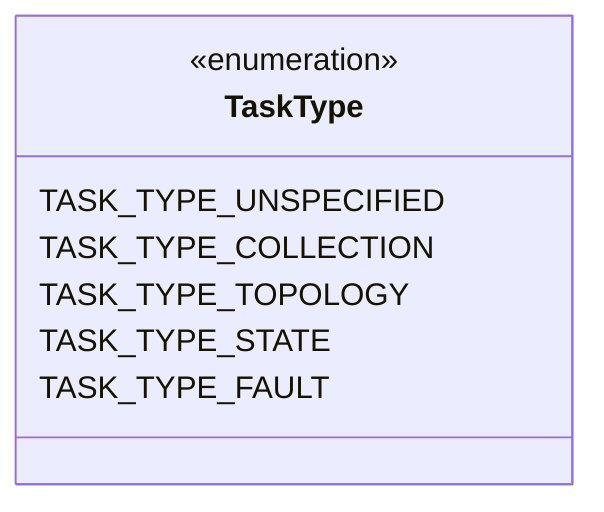
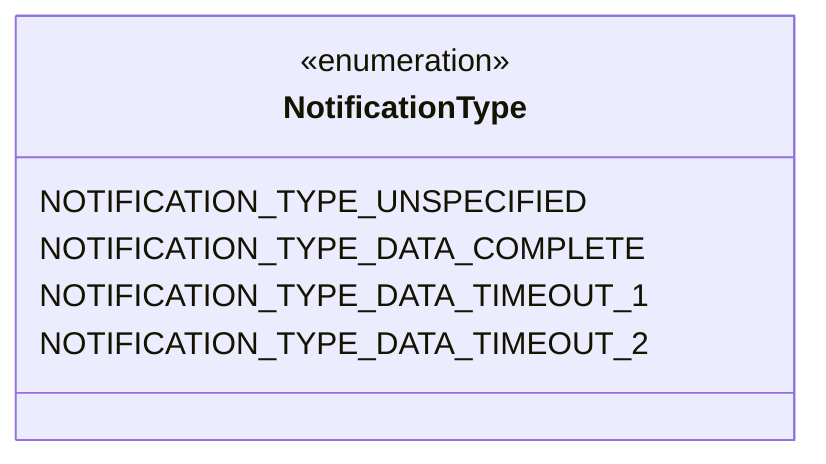
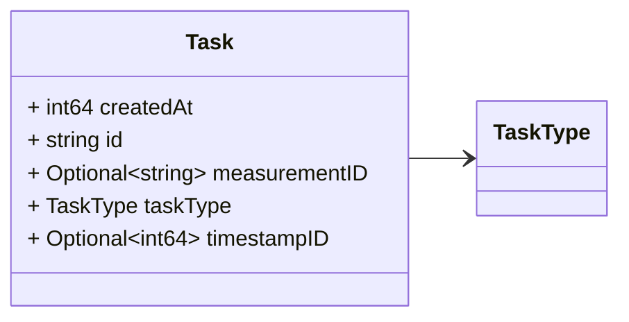
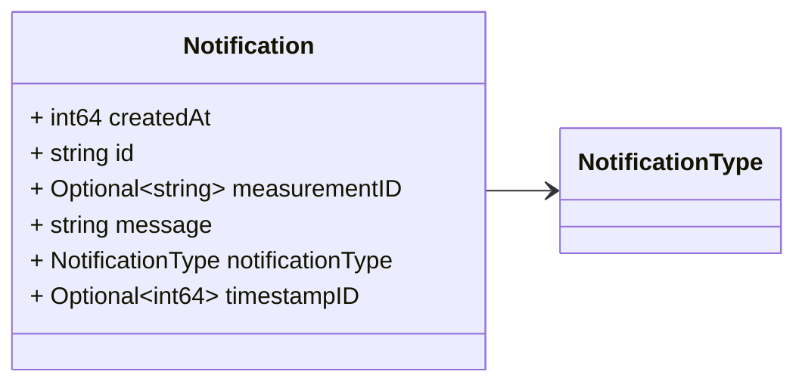

# Package: task.v1

<!-- markdownlint-disable --> 

## Imports

| Import | Description |
|--------|-------------|

## Options

| Name       | Value     | Description |
|------------|-----------|-------------|
| go_package | ./task/v1 |             |

## Enum: TaskType

FQN: task.v1.TaskType

 

| Name                  | Ordinal | Description |
|-----------------------|---------|-------------|
| TASK_TYPE_UNSPECIFIED | 0       |             |
| TASK_TYPE_COLLECTION  | 1       |             |
| TASK_TYPE_TOPOLOGY    | 2       |             |
| TASK_TYPE_STATE       | 3       |             |
| TASK_TYPE_FAULT       | 4       |             |

## Enum: NotificationType

FQN: task.v1.NotificationType

 

| Name                             | Ordinal | Description |
|----------------------------------|---------|-------------|
| NOTIFICATION_TYPE_UNSPECIFIED    | 0       |             |
| NOTIFICATION_TYPE_DATA_COMPLETE  | 1       |             |
| NOTIFICATION_TYPE_DATA_TIMEOUT_1 | 2       |             |
| NOTIFICATION_TYPE_DATA_TIMEOUT_2 | 3       |             |

### TaskType Diagram

### NotificationType Diagram

### Task Diagram

### Notification Diagram

## Message: Task

FQN: task.v1.Task

 

| Field         | Ordinal | Type     | Label    | Description |
|---------------|---------|----------|----------|-------------|
| createdAt     | 3       | int64    |          |             |
| id            | 1       | string   |          |             |
| measurementID | 4       | string   | Optional |             |
| taskType      | 2       | TaskType |          |             |
| timestampID   | 5       | int64    | Optional |             |

## Message: Notification

FQN: task.v1.Notification

 

| Field            | Ordinal | Type             | Label    | Description |
|------------------|---------|------------------|----------|-------------|
| createdAt        | 3       | int64            |          |             |
| id               | 1       | string           |          |             |
| measurementID    | 5       | string           | Optional |             |
| message          | 4       | string           |          |             |
| notificationType | 2       | NotificationType |          |             |
| timestampID      | 6       | int64            | Optional |             |

<!-- Created by: Proto Diagram Tool -->
<!-- https://github.com/GoogleCloudPlatform/proto-gen-md-diagrams -->
