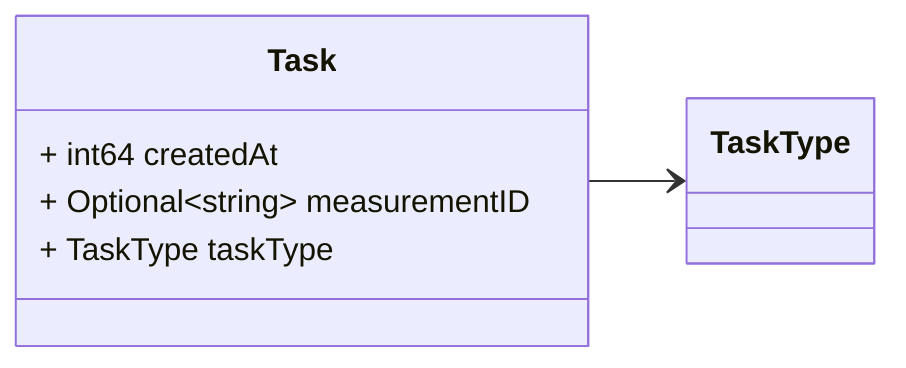
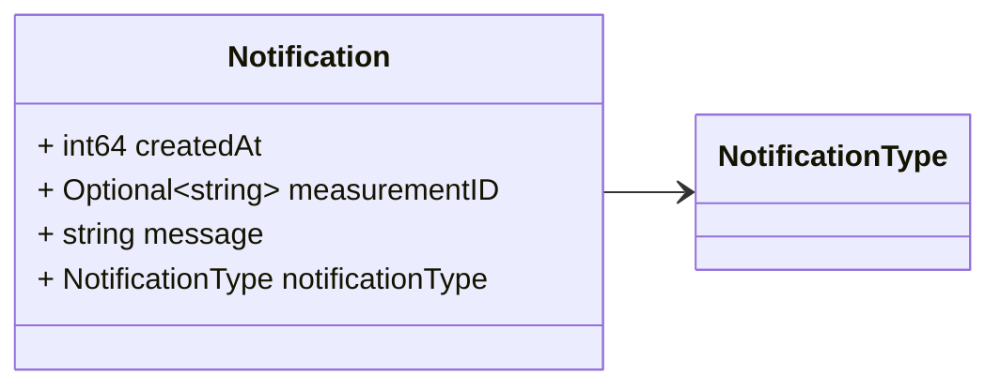

# Package: platform.v1

<!-- markdownlint-disable -->  Messages to support coordination among processes/services in the platform. At the time being this is a proof of concept. Different changes may occurs when we actually start to use the event driven approach to coordinate services. 

## Imports

| Import | Description |
|--------|-------------|

## Options

| Name       | Value         | Description |
|------------|---------------|-------------|
| go_package | ./platform/v1 |             |

## Enum: TaskType

FQN: platform.v1.TaskType

The different type of tasks run by the real time processing. 

| Name                  | Ordinal | Description |
|-----------------------|---------|-------------|
| TASK_TYPE_UNSPECIFIED | 0       |             |
| TASK_TYPE_COLLECTION  | 1       |             |
| TASK_TYPE_TOPOLOGY    | 2       |             |
| TASK_TYPE_STATE       | 3       |             |
| TASK_TYPE_FAULT       | 4       |             |

## Enum: NotificationType

FQN: platform.v1.NotificationType

The different type of notifications generated by the real time processing. 

| Name                             | Ordinal | Description |
|----------------------------------|---------|-------------|
| NOTIFICATION_TYPE_UNSPECIFIED    | 0       |             |
| NOTIFICATION_TYPE_DATA_COMPLETE  | 1       |             |
| NOTIFICATION_TYPE_DATA_TIMEOUT_1 | 2       |             |
| NOTIFICATION_TYPE_DATA_TIMEOUT_2 | 3       |             |
| NOTIFICATION_TYPE_TRIGGER        | 4       |             |

### TaskType Diagram

### NotificationType Diagram

### Task Diagram

### Notification Diagram

## Message: Task

FQN: platform.v1.Task

A task message. Headers used in rabbitMQ: * `id`: id of the `Task` * `type`: always `Task` * `producerId`: the id of the producer (e.g. a PMU) linked to the notification. * `timestampId`: related measurement timestamp (if any) * `taskType`: The textual representation of the task type. 

| Field         | Ordinal | Type     | Label    | Description                               |
|---------------|---------|----------|----------|-------------------------------------------|
| createdAt     | 2       | int64    |          | Task creation time (Unix Nano timestamp)  |
| measurementID | 3       | string   | Optional | Related measurement id (if any)           |
| taskType      | 1       | TaskType |          | Type of the task                          |

## Message: Notification

FQN: platform.v1.Notification

A notification message. Headers used in rabbitMQ: * `id`: id of the `Notification` * `type`: always `Notification` * `producerId`: the id of the producer (e.g. a PMU) linked to the notification. * `timestampId`: related measurement timestamp (if any) * `notificationType`: The textual representation of the notification type. 

| Field            | Ordinal | Type             | Label    | Description                                                                          |
|------------------|---------|------------------|----------|--------------------------------------------------------------------------------------|
| createdAt        | 2       | int64            |          | Notification creation time (Unix Nano timestamp)                                     |
| measurementID    | 4       | string           | Optional | Related measurement id (if any)                                                      |
| message          | 3       | string           |          | Notification message, it can be a string or a integer (which maps to a enum value).  |
| notificationType | 1       | NotificationType |          | Notification type                                                                    |

<!-- Created by: Proto Diagram Tool -->
<!-- https://github.com/GoogleCloudPlatform/proto-gen-md-diagrams -->
