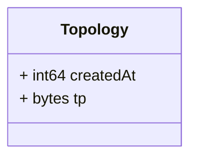

# Package: grid.v1

<!-- markdownlint-disable -->
Messages to support topology data exchange in the platform.

## Imports

| Import | Description |
|--------|-------------|

## Options

| Name       | Value     | Description |
|------------|-----------|-------------|
| go_package | ./grid/v1 |             |

### Topology Diagram

## Message: Topology

**FQN**: grid.v1.Topology

A topology computed information.
Headers used in rabbitMQ:
* `id`: id of the `Topology`
* `type`: always `Topology`
* `producerId`: the id of the producer (e.g. a PMU) linked to the dataset.
* `timestampId`: related measurement Unix msec timestamp (if any)
* `subnetworkId`: the sub network id for which the topology was computed

| Field       | Ordinal | Type    | Label | Description                                                       |
|-------------|---------|---------|-------|-------------------------------------------------------------------|
| `createdAt` | 1       | `int64` |       | The time of creation of the topology data (Unix msec timestamp).  |
| `tp`        | 2       | `bytes` |       | The TP profile file serialized as bytes.                          |

<!-- Created by: Proto Diagram Tool -->
<!-- https://github.com/GoogleCloudPlatform/proto-gen-md-diagrams -->
