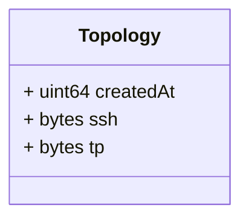

# Package: grid.v1

<!-- markdownlint-disable --> Messages to support topology data exchange in the platform.  

## Imports

| Import | Description |
|--------|-------------|

## Options

| Name       | Value     | Description |
|------------|-----------|-------------|
| go_package | ./grid/v1 |             |

### Topology Diagram

## Message: Topology

FQN: grid.v1.Topology

A topology computed information. Headers used in rabbitMQ: * `id`: id of the `Topology` * `type`: always `Topology` * `producerId`: the id of the producer (e.g. a PMU) linked to the dataset. * `timestampId`: related measurement Unix msec timestamp (if any) * `subnetworkId`: the sub network id for which the topology was computed  

| Field     | Ordinal | Type   | Label | Description                                                       |
|-----------|---------|--------|-------|-------------------------------------------------------------------|
| createdAt | 1       | uint64 |       | The time of creation of the topology data (Unix msec timestamp).  |
| ssh       | 3       | bytes  |       | The SSH profile file serialized as bytes.                         |
| tp        | 2       | bytes  |       | The TP profile file serialized as bytes.                          |

<!-- Created by: Proto Diagram Tool -->
<!-- https://github.com/GoogleCloudPlatform/proto-gen-md-diagrams -->
