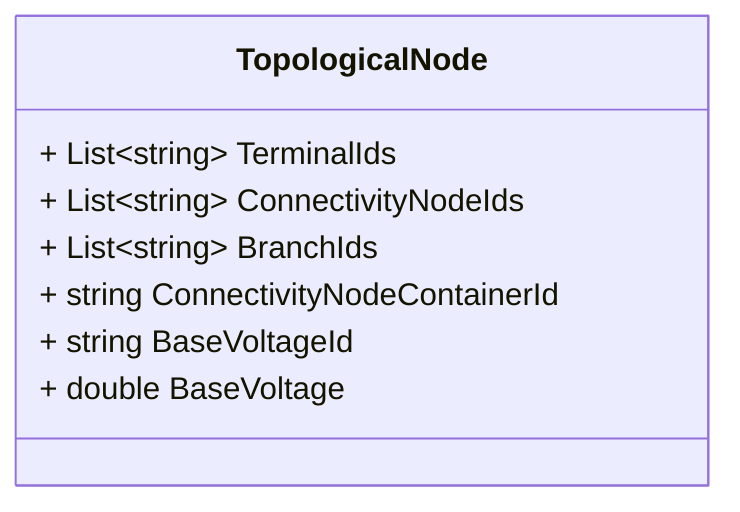
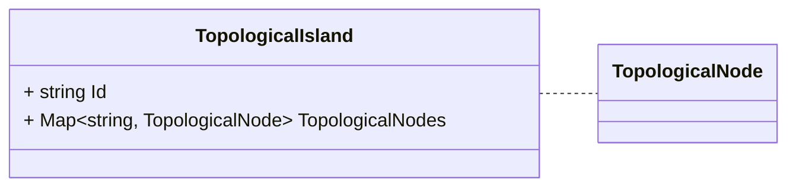
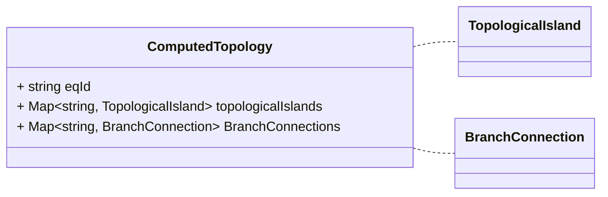

# Package: zaphiro.grid.v1

 <!-- markdownlint-disable -->
Messages to support topology data exchange in the platform.

## Imports

| Import | Description |
|--------|-------------|

## Options

| Name       | Value     | Description |
|------------|-----------|-------------|
| go_package | ./grid/v1 |             |

### Topology Diagram

### TopologicalNode Diagram

### TopologicalIsland Diagram

### BranchConnection Diagram

### ComputedTopology Diagram

## Message: Topology

**FQN**: zaphiro.grid.v1.Topology

A topology computed information.
Headers used in rabbitMQ:
* `id` (string): id of the `Topology`
* `type` (string): always `Topology`
* `producerId` (string): the id of the producer (e.g. a PMU) linked to the dataset.
* `timestampId` (int64): related measurement Unix msec timestamp (if any)
* `subnetworkId` (string): the sub network id for which the topology was computed

| Field       | Ordinal | Type    | Label | Description                                                       |
|-------------|---------|---------|-------|-------------------------------------------------------------------|
| `createdAt` | 1       | `int64` |       | The time of creation of the topology data (Unix msec timestamp).  |
| `tp`        | 2       | `bytes` |       | The TP profile file serialized as bytes.                          |

## Message: TopologicalNode

**FQN**: zaphiro.grid.v1.TopologicalNode

A topology Node information.
* To be used in ComputedTopology message.

| Field                         | Ordinal | Type     | Label    | Description                                                      |
|-------------------------------|---------|----------|----------|------------------------------------------------------------------|
| `TerminalIds`                 | 1       | `string` | Repeated | The list of Terminal ids in the TopologicalNode.                 |
| `ConnectivityNodeIds`         | 2       | `string` | Repeated | The list of ConnectivityNode ids in the TopologicalNode.         |
| `BranchIds`                   | 3       | `string` | Repeated | The list of Branch ids in the TopologicalNode.                   |
| `ConnectivityNodeContainerId` | 4       | `string` |          | The id of the ConnectivityNodeContainer in the TopologicalNode.  |
| `BaseVoltageId`               | 5       | `string` |          | The id of the BaseVoltage in the TopologicalNode.                |
| `BaseVoltage`                 | 6       | `double` |          | The BaseVoltage in the TopologicalNode.                          |

## Message: TopologicalIsland

**FQN**: zaphiro.grid.v1.TopologicalIsland

A topology Island information.
* To be used in ComputedTopology message.

| Field              | Ordinal | Type                      | Label | Description                                                         |
|--------------------|---------|---------------------------|-------|---------------------------------------------------------------------|
| `Id`               | 1       | `string`                  |       | The id of the TopologicalIsland.                                    |
| `TopologicalNodes` | 2       | `string, TopologicalNode` | Map   | The list of TopologicalNode in the TopologicalIsland. TN id -> TN.  |

## Message: BranchConnection

**FQN**: zaphiro.grid.v1.BranchConnection

A wrapper in order to use an array in the map in TopologicalIsland.
* It represents the connections between the TopologicalNodes in the TopologicalIsland.

| Field                | Ordinal | Type     | Label    | Description                                               |
|----------------------|---------|----------|----------|-----------------------------------------------------------|
| `TopologicalNodeIds` | 1       | `string` | Repeated | The list of TopologicalNode ids connected to the Branch.  |

## Message: ComputedTopology

**FQN**: zaphiro.grid.v1.ComputedTopology

A processed topology information.
Headers used in rabbitMQ:
* `id` (string): id of the `Topology`
* `type` (string): always `ComputedTopology`
* `producerId` (string): the id of the producer (e.g. a PMU) linked to the dataset.
* `timestampId` (int64): related measurement Unix msec timestamp (if any)
* `subnetworkId` (string): the sub network id for which the topology was computed

| Field                | Ordinal | Type                        | Label | Description                                                                                         |
|----------------------|---------|-----------------------------|-------|-----------------------------------------------------------------------------------------------------|
| `eqId`               | 1       | `string`                    |       | The id of the EQ file used.                                                                         |
| `topologicalIslands` | 2       | `string, TopologicalIsland` | Map   | The map of TopologicalIslands in the Topology. TI id -> TI.                                         |
| `BranchConnections`  | 3       | `string, BranchConnection`  | Map   | All the connections between the TopologicalNodes in the TopologicalIsland. TN id -> TN connection.  |

<!-- Created by: Proto Diagram Tool -->
<!-- https://github.com/GoogleCloudPlatform/proto-gen-md-diagrams -->
